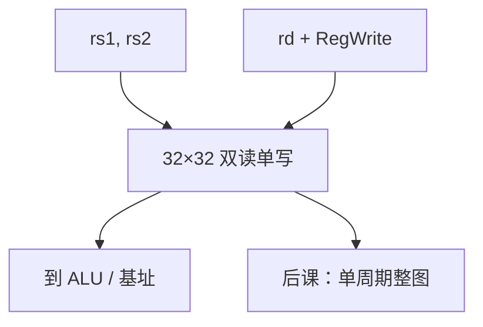

# 寄存器堆

ISA 的 `rs1`、`rs2`、`rd` 是端口上的地址；堆是多口 SRAM，读组合、写在时钟边沿。

<footer>—— 据 Patterson and Hennessy, Computer Organization and Design (RISC-V)；Harris and Harris, Digital Design and Computer Architecture 整理</footer>

上一课[伪指令](/cs/pseudo-instructions)钉死了多数指令要读两个寄存器、写一个。本课不重列 `add` 语义，也不从编译器着色另起。缺口是：**32 个 `x` 寄存器**如何做成电路——不是 32 个分散的命名寄存器手工接线，而是带译码的寄存器堆。

## 问题

[寄存器](/cs/register-shift)课只有一个字。[阵列](/cs/memory-array-sram-dram)课有单口大容量。缺口是小而多口：两个组合读口（地址 `rs1`/`rs2`，数据 `R1`/`R2`），一个同步写口（`rd`、`RegWrite`、`WriteData`）。`x0` 读恒 0、写忽略。内部：32×32 SRAM 或 FF 阵列加两个读 MUX/译码。

写后读（同一条指令内）在单周期里通常「本拍写的下拍才可见」，RISC-V 不要求同一指令读自己的 `rd`。旁路是流水线课。

### 寄存器堆不是「主存的前 32 个字」

地址空间里的内存与 `x` 寄存器是不同结构。`lw` 把内存搬进寄存器，不是给内存取别名。把 `x10` 当成地址 `10` 的 DRAM 单元，调用约定与指针会全部塌掉。

Patterson/Hennessy 把 register file 画成双读单写框。Harris 给出寄存器堆的实现草图。写口用[译码器](/cs/decoder-encoder)产生 32 根使能。

## 方法

读：地址译码选行，组合读出，延迟计入 $t_{pd}$。写：边沿、使能、`rd≠0`。两口同时读同一寄存器应得到同一值。读口与写口同一地址时的旁路策略在单周期可定义为「读旧值」。

## 机制

调用约定把参数放进 `x10`–`x17` 等，是软件对这 32 个槽的用法，硬件一视同仁——[调用约定](/cs/calling-convention-stack)再钉。PC 通常不在整数堆里，是单独寄存器。CSR 是另一组，特权课才碰。

## 边界

本课不讲物理寄存器重命名、不把浮点 `f` 堆画进来。不讨论多核各有一份堆。扫描链、调试口是实现附件。

后课默认：RV32I 的整数状态在双读单写寄存器堆；`x0` 硬 0。单周期数据通路把堆与 ALU、内存、PC 接在一起。

## 小结

- 寄存器堆实现 ISA 的 32 个整数寄存器，双读单写。
- 读组合、写同步；`x0` 特殊。
- 与主存分离；`lw`/`sw` 在二者之间搬数据。
- 出处：Patterson and Hennessy, COD (RISC-V)；Harris and Harris。
