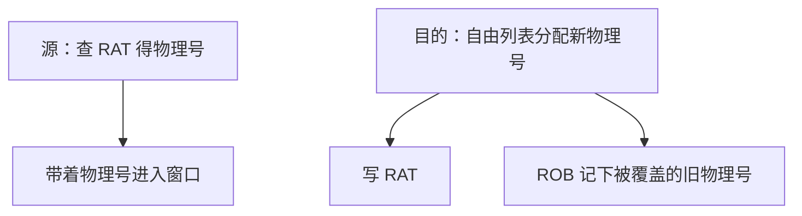

# 寄存器重命名

架构寄存器只有一份名字；把每次写入映射到新的物理槽，写后读仍按数据流，写后写与写后读假相关从窗口里消失。

<footer>—— 据 Keller, A Survey of Register Renaming, 1975；Hennessy and Patterson, CA:AQA 整理</footer>

[上一课](/cs/speculation-recovery)规定误预测要恢复映射表，但还没说映射表里到底记什么。[Tomasulo](/cs/tomasulo) 用标签代替架构名做唤醒，已经是重命名的一种实现。本课不重讲 CDB。缺口是把**架构寄存器 → 物理寄存器**钉成乱序核的前端动作：每次目的寄存器分配新物理槽，源寄存器查当前映射。

## 问题

ISA 把 `add x1, …` 的目的写成 `x1`。窗口里若已有一条未提交的 `add` 也写 `x1`，后面独立的 `add x1, x2, x3` 会被 WAW/WAR 堵住，即使数据流并不依赖那条旧写。[ROB](/cs/ooo-rob) 已经要求提交有序，但若物理上只有一份 `x1`，年轻写仍不能先完成。缺口不是再加检查点，而是**每次写分配新名字**。

RISC-V 的 32 个整数架构寄存器在乱序核里会对应上百个物理寄存器。x0 永不分配：它不是写。

## 方法

前端维护映射表 RAT：架构寄存器号 → 当前物理号（或「值已在架构堆」）。译码一条有目的寄存器的指令：

1. 读源操作数的物理号（从 RAT）；
2. 从自由列表取一个新物理寄存器作为目的；
3. 把旧目的物理号记到 ROB 项，供提交时释放或误预测时恢复；
4. 更新 RAT：该架构寄存器现在指向新物理号。

误预测：把 RAT 恢复成该分支检查点，或从 ROB 从头重放映射。提交：把 ROB 记下的旧物理号放回自由列表——此刻没有指令再读它。

## 机制

RAW 仍在：源物理号指向尚未写完的生产者，发射队列等唤醒。WAR/WAW 不再表现为「必须等旧写提交」：它们写的是不同物理槽。这正是上一课检查点要保存的对象——RAT 是推测状态。

与 Tomasulo 对照：保留站标签 ≈ 物理寄存器号；CDB 广播标签 ≈ 物理号写回。现代核把结果存在物理寄存器堆，保留站只存标签与就绪位，避免复制大向量。

## 边界

本课不把自由列表的宽度、回滚栈的层数写完，那是下一课物理寄存器堆。也不处理条件码 / 标志寄存器：x86 的标志是另一组要重命名的架构状态。内存重命名（store forwarding）是 LSQ，不是寄存器 RAT。

后课默认：窗口内只有物理寄存器号；架构名只在顺序前端与提交端出现。物理槽用完则前端停顿。

## 小结

- 每次写分配新物理寄存器，消除 WAR/WAW。
- RAT 是推测状态，误预测必须恢复。
- 槽从哪来、何时真正释放，是下一课自由列表。
- 出处：Keller 重命名综述；Tomasulo 1967；Hennessy and Patterson, *CA:AQA*。
