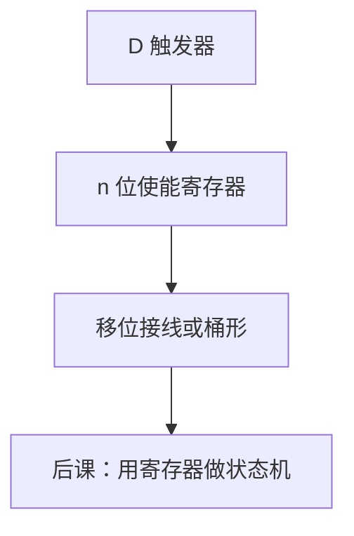

# 寄存器与移位

寄存器是并排的触发器加使能；移位则是相邻位之间的组合接线，用同一拍时钟把字滑一格。

<footer>—— 据 Harris and Harris, Digital Design and Computer Architecture；Patterson and Hennessy, Computer Organization and Design (RISC-V) 整理</footer>

上一课[亚稳态与同步器](/cs/metastability)钉死了 FF 之间的时序不等式。本课不重写 $t_{su}$，也不从 ISA 的 `sll` 另起一张指令表。缺口是：1 比特 FF 还不是 CPU 里的「寄存器」。需要 $n$ 位并列、写使能、以及作为组合/时序混合的**移位**。

## 问题

ALU 输出要在边沿写进一组 FF，且不是每拍都写：`RegWrite` 为假时应保持。缺口是带使能的寄存器：使能接 MUX 反馈 Q，或接时钟门控（后者有自己的时序代价）。移位：逻辑左移把权乘 2（无符号），算术右移复制符号位——语义来自[补码](/cs/twos-complement)，电路是相邻 FF 的 D 接到邻居的 Q，或纯组合桶形接到寄存器输入。

本课钉并行寄存器与移位寄存器两种。寄存器堆是后课多口阵列。

### 移位寄存器不是桶形移位器

移位寄存器每拍移 1 位，延迟是拍数。桶形移位器组合一拍移任意量，延迟是 MUX 树。RISC-V `sll` 要的是后者语义；串行移位是 UART、CRC 的结构。名字都叫移位，时序模型不同。

Harris 分 load-enable 寄存器与移位寄存器。Patterson/Hennessy 的寄存器是程序可见的 32 个字，实现是后课寄存器堆；本课先给 1 个字。

## 方法

$n$ 个 D-FF 共享时钟。Load=1 时 D 来自总线，否则 D=Q。移位模式：每级 D 接上一级 Q，端点接串入或 0/符号。建立保持按最坏位。

## 机制

PC 是带 +4 与跳转 MUX 的寄存器。立即数不存寄存器里也能进 ALU，那是数据通路 MUX。移位作为 ALU 功能时走组合桶形，结果再进寄存器写口；作为外设时用移位寄存器省面积。

时钟门控修功耗，但使能的时序要当时钟完整性处理，本课推荐 MUX 使能作为默认。

## 边界

本课不讲重命名物理寄存器、不把向量寄存器请进来。DRAM 行缓冲不是 FF 寄存器。多时钟仍未正式展开。

后课默认：一个字的状态是带写使能的并行 FF；指令移位是组合桶形加写回。

## 小结

- 寄存器 = 并行 FF + 写使能。
- 串行移位按拍；指令移位通常是组合桶形。
- 算术右移复制符号位，逻辑移位补 0。
- 出处：Harris and Harris；Patterson and Hennessy, COD (RISC-V)。
