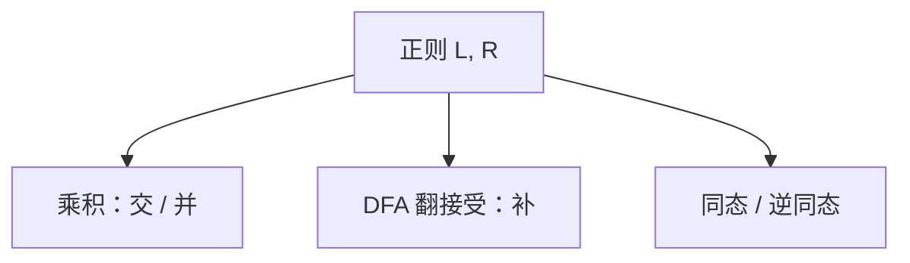

# 正则语言的封闭性

并、连接、星、补、交、同态、逆同态都把正则语言送回正则；构造乘积机或替换字母，不必回到正则式。

<footer>—— 据 Kleene, Representation of Events in Nerve Nets, 1956；Hopcroft and Ullman 整理</footer>

上一课[DFA 最小化与 Myhill–Nerode](/cs/dfa-minimization)给出正则的规范自动机。本课不重做划分。缺口是：**对语言做集合运算之后还是否正则**。封闭性既是构造工具，也是证非正则的杠杆（若 $L\cap R$ 非正则而 $R$ 正则，则 $L$ 非正则）。

## 问题

已知 $L,R$ 正则。并：正则式直接写 $+$，或 DFA 乘积取接受并。交：乘积取接受交。补：DFA 接受态翻转——这里必须是完全 DFA，NFA 直接翻会错。连接与星：NFA 上加 $\varepsilon$ 边最干净，再确定化。同态 $h:\Sigma\to\Gamma^*$ 把字母换成串，正则的像仍正则；逆同态更常用：正则的原像仍正则。

主干词法把多种别正则并成一张表，已经用过并。本课把清单收全，并强调**补必须走 DFA**。

### 封闭不是「任意运算」

商 $L/R=\{x\mid \exists y\in R,xy\in L\}$ 对正则也封闭，但无限并一般不封闭。置换成上下文无关语言可以破坏正则。本课清单以自动机可构造的为准。

Kleene 代数把并、连接、星当成正则的签名。Hopcroft–Ullman 用乘积机写交与补。逆同态是后课「把问题编成正则」时的标准手法。

## 方法

要证 $L$ 非正则：找正则 $R$ 使 $L\cap R$ 等于已知非正则（如 $a^nb^n$）。要证封闭：画乘积或改转移，不写「显然」。同态：把每条标 $a$ 的边换成一条标 $h(a)$ 的路径。

[子集构造](/cs/nfa-dfa)保证 NFA 侧的连接、星可回到 DFA。最小化可做可不做，封闭性不依赖状态数最小。

## 机制

乘积机状态是对 $(p,q)$，同时模拟两个 DFA。补之所以简单，因为 DFA 对每个串恰好一条路：不接受即应接受。CFL 对补、交不封闭，这正是下一课要离开正则的原因之一——光靠布尔运算不够描述嵌套。

同态可以擦掉信息（$h(a)=h(b)=\varepsilon$），所以同态像比原语言「更容易」正则；逆同态把字母表译码回来，常用来从简单语言造复杂实例。

同态可以擦符号，因此「正则的同态像」不能用来证明原语言正则——方向反了。逆同态保留正则，常把「看起来不规则」的编码还原成 $a^nb^n$ 的切片。补的构造必须先确定化：NFA 接受路径存在性，翻接受态会把「另有一条路该拒绝」弄错。

## 边界

本课不证星高的完整代数公理，不引入正则语言的一阶逻辑刻画（Büchi）。不把 CFL 封闭性提前写完。后课默认：正则在布尔运算与（逆）同态下关闭；证非正则可以交一个正则「切片」。下一课为 CFG 配下推栈。

封闭性证明优先给自动机构造，再谈最小化——正确性不依赖状态最少。用封闭性证非正则时，切片语言必须已知非正则，不能循环论证。

## 小结

- 并、交、补、连接、星、同态、逆同态保持正则。
- 补要完全 DFA；交用乘积。
- 与已知非正则相交，是排除正则的第二杠杆。
- 出处：Kleene, 1956；Hopcroft and Ullman。
