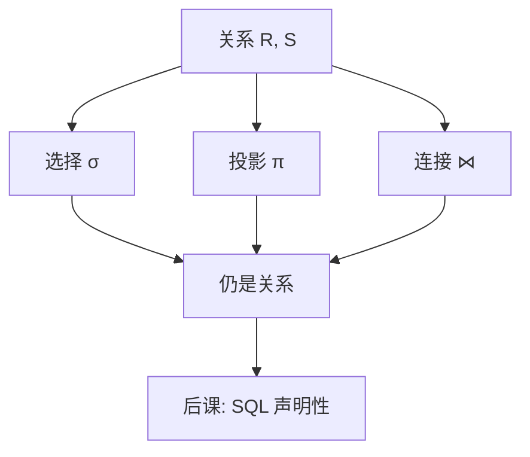

# 关系代数

五种基本运算生成关系上的闭包；其余运算是简写，不是另一套数据模型。

<footer>—— 据 Codd, Relational Completeness of Data Base Sublanguages, 1972 整理</footer>

[上一课](/cs/fk-actions)钉死了键与参照完整性：元组可识别，引用是值。本课不重讲候选键。缺口是：有了合法的关系实例，如何从已有关系算出新关系，而不先指定扫描顺序或索引。查询需要一套对关系封闭的运算，后课 SQL 才有指称语义。

## 问题

文件 API 的操作是读字节、写字节。[关系](/cs/relational-model)若只有存储没有运算，应用仍会把循环写进客户端。Codd 要的是代数：选择、投影、并、差、笛卡尔积（或自然连接）对关系封闭，复合仍是关系。缺口不是「会不会 SELECT」，而是先有可推理的表达式。

完整性已经保证运算的输入合法；代数不负责再检查外键。本课也不引入代价：同一个表达式可以对应许多物理计划，那是后课。

并与差要求并相容：属性数目与域一致。投影会去掉键，结果可能不再满足原表的实体完整性——结果是新关系，键另算。

## 方法

基本运算：$\sigma_\theta(R)$ 按谓词筛选元组；$\pi_A(R)$ 保留属性集 $A$；$\cup$、$-$ 在并相容的关系上做集合并与差；$R\times S$ 为笛卡尔积。自然连接 $R\bowtie S$ 是在共享属性上等值后投影掉重复列，可从积与选择导出。改名 $\rho$ 解决属性冲突。

除法、半连接、外连接是派生。本课锁定闭包与复合，不把外连接的 NULL 语义写完——那是 SQL 的缺口。安全的查询（不生成无限关系）在有限实例上自动满足；演算的安全限制本课不展开。

## 机制

代数表达式是树：叶是命名关系，内节点是运算。等价的树表示同一映射，这是后课改写的对象。选择与投影可下推到叶，是因为它们与连接交换（在无副作用、集合语义下）。键在运算中的去向可以静态看：连接保留键的组合条件，投影可能丢掉键。

集合语义下 $\pi$ 要去重。包语义（SQL 默认）把去重变成可选项，代数律仍大致可用，但基数估计必须改——后课代价估计才碰。本课按集合讲，避免第一课代数就陷入 NULL 与包。

## 边界

本课不是 SQL 教程，不写嵌套子查询，不引入聚合与分组。分组破坏「结果是元组集合、属性来自输入」的简单图像，是后课声明语言的扩展。也不把代数当成必须由人手工执行的计划：物理算子在[连接算法](/cs/join-algorithms)。

后课默认：谈到查询的含义，先有一棵代数树；SQL 是这棵树的写法，不是另一套模型。

## 小结

- 键已在；本课给出关系上封闭的运算与复合。
- 选择、投影、并、差、积（连接）是骨架；其余是简写。
- 表达式树是后课优化的对象，本课不谈代价。
- 出处：Codd, 1970 与 1972；Garcia-Molina, Ullman and Widom, *Database Systems: The Complete Book*。
