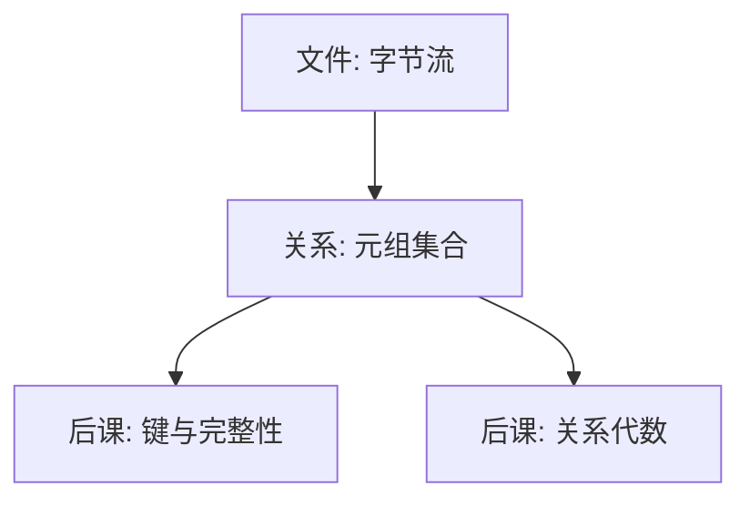

# 关系模型

把数据看成命名属性上的元组集合，查询才不必绑定某一种文件布局。

<footer>—— 据 Codd, A Relational Model of Data for Large Shared Data Banks, CACM 1970 整理</footer>

[上一课](/cs/socket-nonblock)把进程间通信收到套接字：字节可以跨主机送达。[文件作为字节流](/cs/file-bytestream)已经把持久化写成可寻址的字节序列，[B 树与外存](/cs/btree-external)已经能按键查找，[缓冲与脏页](/cs/buffer-dirty)已经承认内存与磁盘可以不一致。本课不重讲套接字、文件或 B 树。缺口是：字节和文件都在，但还没有把「一张表、一行、一个属性」命名成关系，完整性更无从说起。后课默认已经读完本课。

## 问题

文件系统给出的是名字到字节流的映射。同一批关于「谁订了哪张票」的事实，可以写成定长记录、可以写成 JSON 行、可以写成指针网。若查询必须绑定某一种布局，换存储就要改应用。Codd 要的不是新磁盘格式，而是一层与布局无关的抽象：事实是关系，操作是对关系的闭包。

缺口因此不是「数据是什么」，而是命名。域、属性、元组、关系一旦钉死，后课的键、代数和 SQL 才有对象。本课不引入主键，不写 SQL，不谈页。

关系是元组的集合，不是包；SQL 后来允许重复行，那是实现与标准对集合语义的放松，后课再对照。

## 方法

取有限个域 $D_1,\ldots,D_n$。关系模式是属性名到域的指派；一个关系是该模式上元组的有限集合，每个元组在每个属性上取该域中的一个值。属性无序：列的左右不是语义。元组无序：没有「第 $i$ 行」除非另加排序约定。

一阶谓词演算里，关系对应外延：满足某谓词的那些元组。本课不把演算展开成证明系统，只锁定：**查询是从关系到关系的函数**，结果仍是关系。层次模型、网状模型用指针当一等对象；关系模型把连接写成值相等，不把指针暴露给用户。

## 机制

一旦事实是关系，同一查询可以对不同存储求值：堆文件、聚簇、索引都是后课的物理选择，逻辑层看不见。值相等代替指针，使跨文件的「谁引用谁」可以写成比较，而不必保证地址稳定。这也是后课完整性的入口：引用是值，不是悬挂指针。

关系有度（属性个数）与基数（元组个数）。度是模式的一部分，基数随更新变。空关系合法；空与「模式尚未定义」不是一回事。本课也不把 NULL 请进域——三值逻辑是 SQL 课的缺口。

## 边界

本课不规定第一范式的细节，不讨论嵌套关系，不把「表」等同于 Excel 网格。Codd 1970 的贡献是数据独立性：逻辑模式与存储、用户视图分离。存储怎么分页、崩溃怎么恢复，仍用[缓冲与脏页](/cs/buffer-dirty)那一套，只是对象从字节变成了元组。

也不要把关系模型写成「SQL 数据库」。SQL 是后课的声明语言；键、代数、优化、WAL 都还没有。网状与层次模型用指针当一等公民，本课把它们留在对照里：主干只走值。后课默认：谈到表，指的是带模式的关系；谈到行，指的是元组。

后课写键、代数、SQL 时，不再从「数据是什么」起笔。本课交出的对象只有：带属性名的有限元组集，以及「查询是关系到关系」。

## 小结

- 字节与文件已在；本课只命名关系：属性上的元组集合。
- 查询是关系上的闭运算；连接靠值，不靠指针。
- 键、代数、SQL、页都是后课的缺口。
- 出处：Codd, *CACM* 13(6), 1970；Date, *An Introduction to Database Systems*。
