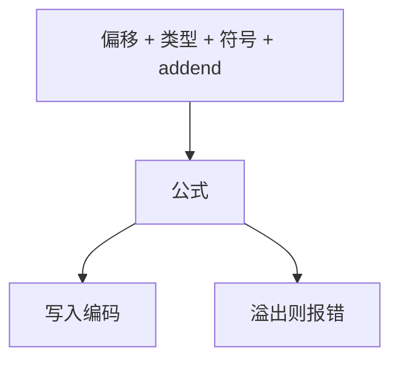

# 重定位类型

每条重定位记录写明：在这一偏移，用符号的地址按何种公式填多少位。ABS、PC 相对、GOT、TLS 各是一种类型。

<footer>—— 据 ELF 规范与 psABI（`R_X86_64_*`、`R_RISCV_*`）；主干[链接与重定位](/cs/link-reloc)；Levine 整理</footer>

上一课[符号插入](/cs/symbol-interposition) 决定绑到谁。缺口是**怎么写成指令编码**：类型不同，公式 `S+A-P`、`G+A` 等不同。主干给过直觉。本课钉类型家族，不枚举全部枚举值。ICF 下一课。

## 问题

汇编器对 `call foo` 发一条对 `foo` 的 PC 相对重定位。链接或加载时计算位移，检查是否溢出立即数。缺口是**类型 → 公式 → 宽度**，不是预加载序。

动态：`R_*_GLOB_DAT`、`JUMP_SLOT` 填 GOT/PLT。TLS：`TPOFF` 等，模型不同（GD/IE/LE）。

### 类型不是「再编译」

链接器按记录改字节，不调前端。溢出则报 `relocation truncated`。选择器应选得上的指令，否则后端要改用 GOT 间接。

psABI 文档是权威表。本课家族：绝对、相对、GOT、PLT、TLS。不抄一百行枚举。

## 方法

编译器：PIC 则多发 GOT 型。链接器：静态应用公式；动态把部分记录拷进 `rela.dyn` 给加载器。检查：对齐、范围。

与[指令选择](/cs/tree-pattern-isel)：选 `b` 还是 `auipc+jalr` 取决于估计范围与 PIC。

## 机制

RELA vs REL：加数在记录里还是在被改处。Relaxation：链接器把远跳改近跳，删序列——RISC-V 常见。不要假设所有类型都可 relax。

安全：写重定位的段权限，TEXTREL 使文本可写，应避免。

## 边界

本课不写 TLS 全部模型推导。后课默认：重定位类型由 psABI 定义。下一课 ICF：相同代码节折叠，依赖重定位可调整。

也不把重定位当 git rebase。

## 小结

- 类型编码公式与宽度；失败则截断错误。
- PIC/TLS/PLT 使用不同家族。
- relaxation 是链接期再选择。
- 出处：ELF 与 psABI；Levine；对照主干 link-reloc。
