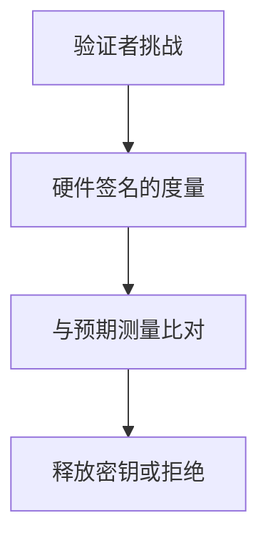

# 远程证明

远程证明让验证者得到一份由硬件根签名的度量：启动了什么、飞地测量是什么。信任锚在厂商证书链，策略在验证者：度量不匹配就不交秘密。

<footer>—— 据 Coker et al. 对证明架构；Intel SGX 远程证明文档；TPM PC Client 规范点名</footer>

## 定位

上一课[机密计算](/cs/confidential-computing)要先证明再交钥。缺口是**报价协议**：谁签、签什么、如何吊销。不写伪造证明的步骤。

后课默认已经读完本课钉下的合同，只补差，不从该领域第一性原理重开。

## 问题

本地 TEE 只能自己信。远程：引用（quote）含测量与随机挑战。缺口是验证者策略与厂商基础设施可用性。

### 吊销

CPU 微码漏洞后证明密钥可能被吊销。可用性与安全再次打架。

TPM/SGX 证明文献。禁止伪造。安全启动下一课是本地链。

## 方法

画：挑战、度量、签名、验证者比对预期哈希。下一课安全启动链：本地从 ROM 到内核。

图中节点是本课的机制骨架；课程不把图展开成可运行的攻击步骤。

## 机制

把「我是谁」从软件自述换成硬件根。安全启动是同一度量在启动路径上的本地版本。

前提写进合同之后，游戏外的误用只当失败模式点名，不在本课写成操作程序。

## 边界

不写伪造报价。安全启动链下一课。

## 小结

- 机密计算靠证明才交钥。
- 报价 = 度量 + 挑战 + 硬件签。
- 验证者策略与厂商链是 TCB。
- 下一课安全启动链。
- 出处：Coker et al.；Intel SGX 证明；TPM 规范。
