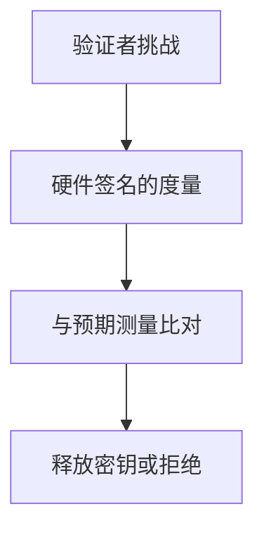

# 远程证明

远程证明让验证者得到一份由硬件根签名的度量：启动了什么、飞地测量是什么。信任锚在厂商证书链，策略在验证者：度量不匹配就不交秘密。

<footer>—— 据 Coker et al. 对证明架构；Intel SGX 远程证明文档；TPM PC Client 规范点名</footer>

上一课[机密计算](/cs/confidential-computing)说飞地要先证明自己、再拿密钥。本课补这条**报价协议**：谁签、签什么、如何吊销。不写伪造证明的步骤。

后课默认已经读完本课钉下的合同，只补差，不从该领域第一性原理重开。

## 问题

本地 TEE 的度量只有本机自己信，远端无法核实。远程证明补上这一步：验证者发随机挑战（防重放），TEE 返回引用（quote）——硬件私钥签名的度量与挑战；验证者沿厂商证书链验签，再与预期度量比对。缺口有两处：验证者的策略——哪些度量放行、密钥给谁——要自己定义；厂商基础设施（证书链、证明服务）的可用性成了新的依赖。

### 吊销

CPU 微码漏洞曝光后，对应批次的证明密钥可能被厂商吊销。吊销抬高了安全下限，但已部署设备随之集体失能——可用性与安全再次打架，验证者策略里要预留灰度与豁免流程。

TPM/SGX 证明文献。quote 里的随机挑战防重放：换场景的旧报价不再有效。禁止伪造。安全启动下一课是本地链。

## 方法

协议四步：验证者发挑战，TEE 算度量，硬件签名打包成 quote，验证者验签并比对预期哈希，匹配才释放密钥。每一步都可能失败，验证者要显式写好「比对不上就拒绝」的路径，不能超时默认放行。下一课安全启动链：本地从 ROM 到内核。

```mermaid
flowchart TD
  CH["验证者挑战"] --> Q["硬件签名的度量"]
  Q --> POL["与预期测量比对"]
  POL --> REL["释放密钥或拒绝"]
```

## 机制

机制上是把「我是谁」的依据从软件自述换成硬件根：软件可以谎报版本，而度量在硅内算出、私钥不出芯片，谎报就得伪造签名。安全启动是同一度量机制在启动路径上的本地版本——先度量再执行，信任沿链传递。

## 边界

不写伪造报价的方法，也不展开厂商证明服务的部署细节。安全启动链下一课。

## 小结

- 机密计算的密钥要等证明通过才释放。
- 报价 = 度量加挑战加硬件签名。
- 验证者策略与厂商证书链都在 TCB 里。
- 下一课安全启动链。
- 出处：Coker et al.；Intel SGX 证明；TPM 规范。
