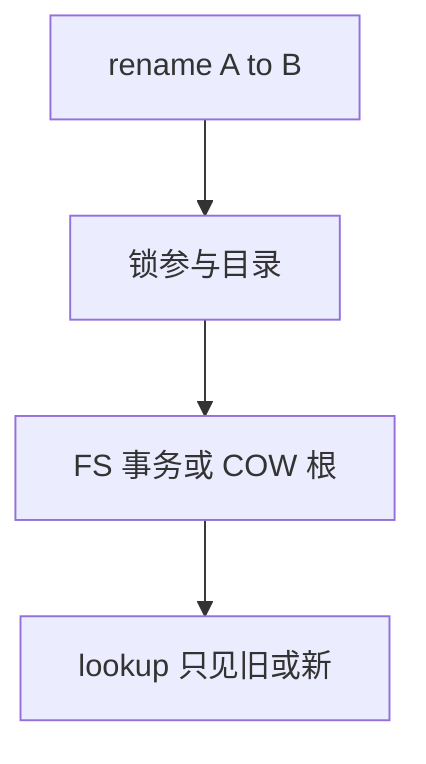

# rename 原子性

POSIX rename 要求：同一文件系统内，新名字要么完全指向新对象，要么仍是旧的；读者不应看见「两个名字都没有」的中间态。

<footer>—— 据 POSIX rename；McKusick 对目录项更新与崩溃的讨论；ext4 对 rename 进事务的实践</footer>

[上一课](/cs/inotify)把 rename 当成一对 cookie 事件。应用更关心：**替换配置文件**时，读者打开的是完整旧文件或完整新文件。缺口是 rename 的原子性与其实现依赖——目录项、链接计数、跨目录、跨 FS 失败。

## 问题

写 `foo.tmp` 再 `rename(foo.tmp, foo)` 是经典发布手法：查找 `foo` 的人不应落到半截内容。POSIX：同挂载内 rename 覆盖已存在目标（非目录）是原子替换。跨设备返回 `EXDEV`，用户态才拷贝。缺口：内核如何把「删旧目录项、加新目录项、调整 `..`、减目标链接」收成一块；[日志](/cs/ext4-journal) 与 [COW](/cs/cow-filesystem) 如何保证崩溃后不是半改；软更新如何排序这两项。

目录 rename 还要改子目录 `..`，并防止把目录挂到自己的子孙下。whiteout 与 overlay 的 rename 另有规则，本课先钉底层 FS。

## 方法

ext4：rename 参加 JBD2 事务，目录块与 inode 一起提交。btrfs：新树根同时包含两项更新。无日志 FAT：两步目录项更新，崩溃可丢名或双名，靠 [fsck](/cs/fsck)。VFS 先锁参与的目录 inode（锁序避免死锁），再调具体 `rename`。读者 lookup 要么看见旧 dentry 要么新的——[dcache](/cs/dcache) 在事务/锁下更新。

## 机制

rename 原子性把「发布」从字节拷贝里解放出来：内容早已 fsync 在临时 inode 上，名字切换才是可见点。它不保证跨文件的多对象原子（那要更上层事务）。不要把本课写成数据库 `UPDATE` 的 MVCC：对象是目录项。

与 [NFS](/cs/nfs-semantics)：远程 rename 的原子性取决于服务器；客户端缓存可能短暂看见旧名。与 inotify：原子替换仍可能产生 DELETE+CREATE 或 MOVED_*，应用不能假设只有一种事件形状。

实现上：跨目录 rename 要锁两个目录，锁序按 inode 号避免死锁。目标若是非空目录，POSIX 失败；覆盖文件则减链接，可能把还打开的 inode 变成匿名。 读法上只引用[上一课](/cs/inotify)的结论，不把对象换成训练推理或限价簿。

本课在操作系统进阶的「文件系统实现 / 接口进阶」课序里，对象是 **rename 原子性**。

- 先修只引用，不重导：上一课的结论当公理，本课只补差。
- 五栏不吞并：不把本课写成大模型训练/推理，也不写成限价簿或权重量化。
- 文献用 OSTEP、McKusick、内核文档与具名会议论文；不发明 arXiv 编号。

## 边界

本课不引入 `renameat2` 的 `RENAME_EXCHANGE`/`NOREPLACE` 全部标志当考纲，只承认它们改变失败条件，不改变「成功则原子」。下一课看不必落盘的树：tmpfs。

版本字段会变，课序钉的是机制对象「rename 原子性」，不是某一主线内核的结构体名。
后课默认：同 FS 内 rename 是名字发布点。纯内存文件系统如何实现同一套 VFS 操作，下一课 tmpfs。

## 小结

- 同挂载 rename 对 lookup 原子；跨设备 EXDEV。
- 实现靠日志事务、COW 根或谨慎写序。
- 内存 FS 是下一课。
- 出处：POSIX；McKusick；ext4/btrfs rename 路径；*OSTEP*。
