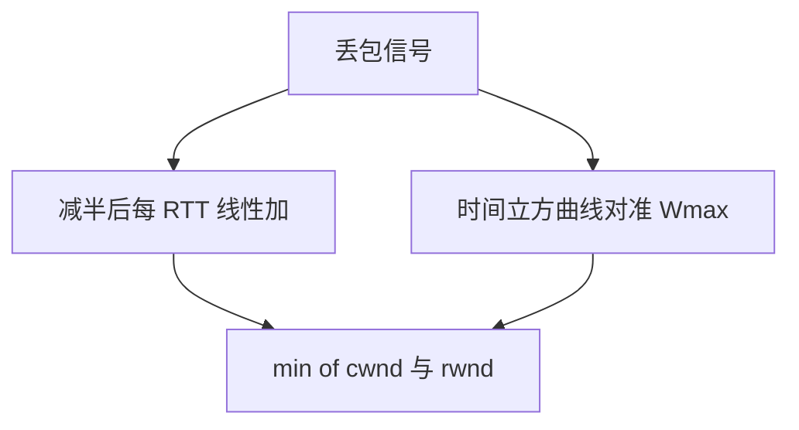

# Reno 与 Cubic

Reno 用丢包把窗口线性加减；Cubic 把窗口增长改成与真实时间相关的三次曲线，让高带宽长延迟路径不再等一个 RTT 才加一。

<footer>—— 据 Jacobson, 1988；RFC 5681；Ha, Rhee and Xu, CUBIC；Kurose and Ross</footer>

[上一课](/cs/tcp-congestion)给出慢启动、拥塞避免与 AIMD 的 `cwnd`。本课不重推「为何要有拥塞窗口」。缺口是具体响应曲线：经典 Reno（及 NewReno）把一次丢包当成减半再线性爬升；大 BDP 路径上爬升太慢。Cubic 用墙钟时间对准上次减窗点。本课不把 BBR 的瓶颈带宽估计提前。

## 问题

[拥塞控制](/cs/tcp-congestion)留下 AIMD。Reno：快重传、快恢复，ssthresh 减半，避免阶段每个 RTT 约加一 MSS。窗口要加到十万 MSS 量级时，线性加太慢，链路长期欠载。Cubic：增长函数是对「距上次拥塞多久」的立方，拐点在上次窗口附近，并与 Reno 友好区做比较。缺口是**同一套丢包信号下的窗口几何**。

NewReno 修的是一次窗口内多丢包时快恢复的退出。Cubic 是 Linux 长期默认之一。它们仍把丢包当拥塞信号，与后课 BBR 不同。

## 方法

Reno 族：按 RFC 5681 的阶段机更新 `cwnd`，发送速率受 `min(cwnd, rwnd)` 限制。Cubic：维护 Wmax，用墙钟计算目标窗口，再换算成每 ACK 的增量。丢包仍减窗（Cubic 减得比一半更温和）。本课不把 HyStart 全部启发式当正文。

## 机制

两者都是端到端、不靠路由器显式信号（ECN 可叠加，本课不展开）。正确性仍是 TCP 可靠流；变的是共享瓶颈时的速率轨迹与友好性。假丢包（无线、[RTO](/cs/tcp-rto) 估错）会让窗口无谓下降——这是丢包信号的代价，下一课换延迟/带宽观测。

## 边界

本课不把每个操作系统的默认算法年表背完。基于测量瓶颈带宽与最小 RTT 的控制，下一课 BBR 对照。

后课默认：丢包驱动的 AIMD 有 Reno 与 Cubic 两条常用曲线。另一条路是不把丢包当唯一信号。

## 小结

- Reno：丢包减半，避免阶段线性加。
- Cubic：用时间立方填满高 BDP。
- 测带宽与 RTT 的对照下一课。
- 出处：RFC 5681；CUBIC（Ha 等）；Kurose and Ross。
