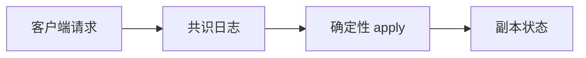

# 复制状态机

确定性状态机 + 同一输入日志 ⇒ 同一状态。共识的任务是复制那条日志，不是复制内存字节。

<footer>—— 据 Schneider, Implementing Fault-Tolerant Services Using the State Machine Approach, CSUR 1990 整理</footer>

上一课[会话保证](/cs/session-guarantees)仍允许全局分叉。缺口是**所有客户端看见同一操作序**：锁、配置、事务提交需要这个。本课钉 Schneider 的状态机方法，把前面的线性一致对象还原成「日志上的确定性 apply」。后课 Paxos 才说日志怎么达成。不重写 CRDT 半格。

## 问题

副本各自有状态 $s$，操作 $o$ 是确定性的：$s'=\delta(s,o)$。若所有正确副本 apply 同一序列 $o_1,o_2,\ldots$，则状态永远相等。故障：崩溃停副本落后，追上日志即可。缺口从「复制状态」变成「复制输入序」——带宽与语义都更干净，因为状态可能很大，操作很小。

非确定性（时间、随机、线程调度）必须赶出 $\delta$：把随机数当输入放进日志，而不是各机自抽。这是实现 RSM 最常见的破法。

Schneider 1990 综述把 Lamport 时间、共识、拜占庭都接到状态机框架。主备传状态是另一方法，上单元已讲。

## 方法

三件套：共识模块输出已提交前缀；状态机按前缀 apply；客户端把请求交给共识（或领导者）。快照把前缀压缩成状态，截断日志——后课 Raft 快照。读：跟日志提交点走则线性一致；读落后副本则掉档。

与寄存器 quorum：RSM 给的是操作的全序，能实现任意对象，不只是读写寄存器。与 CRDT：RSM 协调贵、语义任意；CRDT 无协调、语义受限。

## 机制

线性化点：通常在日志提交（多数派持久）处，apply 必须在返回前完成，或返回的索引对后续读可见。Raft 的 read index、lease read 是优化，不改这一定义。

拜占庭 RSM 要求确定性**且**不能让叛徒提交两条日志——那是 PBFT。崩溃 RSM 用 Paxos/Raft/VR。本课故障类仍默认崩溃停或崩溃恢复（日志在盘上）。

本课不把 Kubernetes 控制器当 RSM 证明：调和循环是最终一致。也不把 WAL 单机恢复当成分布式日志共识。

## 边界

本课不写 prepare/accept 消息，不引入成员变更。后课默认：要线性一致任意对象，用 RSM；日志的共识算法从 Paxos 讲起。主备是状态转移特例，链是提交点特例，都不是任意 $\delta$ 的通用解。

输入序是唯一需要共识的东西。状态是推论。下一课开始付共识的消息税。

## 小结

- RSM：同一确定性 $\delta$ + 同一已提交日志。
- 非确定性必须进日志，不能进 $\delta$。
- 读的一致性档取决于读到哪条提交前缀。
- 出处：Schneider, CSUR 1990。
