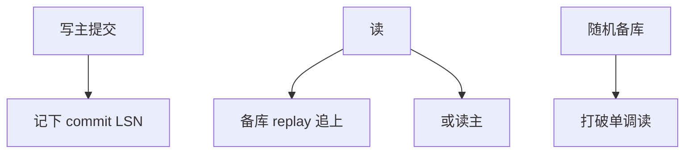

# 复制延迟与读己之写

写主读备时，用户可能读不到刚写的行。读己之写是会话合同，不是隔离级别自带的礼物。

<footer>—— 据 Bailis et al. 对会话保证；Gray 复制；半同步对照</footer>

[上一课](/cs/semi-sync-replication)让提交等备库。本课即使 ACK 了 apply 仍可能落后，异步更甚。事务进阶在此封口。缺口是会话：应用写主后立刻读备，看见旧快照。主干复制课点到延迟；进阶钉 **read-your-writes** 及常见补丁（粘滞、等 LSN、只读走主）。

## 问题

隔离级别描述单副本上的并发。多副本上，因果与会话要另写。读己之写：同一客户端写提交后，其后续读应看见该写（或更新）。单调读：不回到更旧快照。缺口是备库 apply 落后于主的提交 LSN。

半同步保证备库**收到**，不保证**已 apply**，更不保证**你的下一次读打到该备**。负载均衡随机备库会打破单调读。

会话保证文献（read-your-writes、monotonic reads）。本课工程补丁。分布式数据库课会把因果与 TrueTime 再升级。

## 方法

写后读主：简单，备库只承担落后只读。会话粘滞：同一会话钉同一备，并记录主上 `commit_lsn`，读前等备库 `replay >= lsn`（或超时走主）。令牌：把 LSN 放进用户 cookie。

CDC 下游更滞后，不能当读己之写存储除非等。

## 机制

连接池：还池丢会话粘滞则保证碎——连接池课的状态泄漏在复制层重现。只读事务快照若取自落后备库，分析一致但是陈旧，要标 SLA。

故障：等 LSN 超时应失败可见，不能悄悄返回旧行当成功。

## 边界

本课不讲分片键。也不把读己之写当线性一致。恢复复制续结束：从 ARIES 到会话读。

后课默认：读备库要会话合同；默认教学写后读主。下一课程分布式：分片键与再平衡，故障域变成多主存储。

延迟是复制的物理；会话保证是应用看见的逻辑。

## 小结

- 读备库需显式读己之写：等 LSN、粘滞或读主。
- 随机负载均衡破坏单调读；池必须带会话状态。
- 下一课程分片键与再平衡。
- 出处：会话保证文献；Gray；复制实践。
