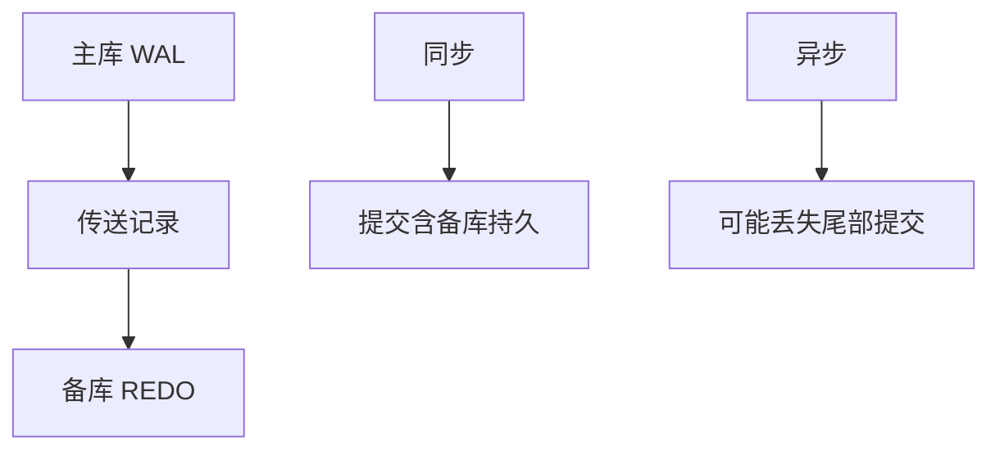

# 复制与日志传送

把 WAL 运到备库重放，备库得到同一串已提交历史；同步还是异步决定故障时丢多少提交。

<footer>—— 据 Gray and Reuter 对复制；ARIES 日志作为运输对象；Bernstein 对照</footer>

[上一课](/cs/two-pc)让多个资源管理器一起提交。本课不重做投票。缺口是同一数据库的**副本**：不是两个独立 RM 的原子，而是一份历史的拷贝。日志传送（物理重放）与逻辑复制（重放 SQL）是两条路。分片下一课切的是键空间，不是同一键的副本。

## 问题

2PC 留下「跨 RM」。高可用常常是：一个主库接受写，备库应用主库日志。同步复制：提交等备库落日志，持久更强、延迟更大；异步：提交先返回，主挂可能丢尾部。缺口是**用 WAL 当复制管道**，复用 ARIES 的 REDO 解释器。

副本不是快照隔离的读者集合自动扩展：只读备库的可见性仍要定义。脑裂（两个主）是故障切换的规格问题，本课只点名。

## 方法

主库刷提交记录后（或同时）发送给备。备库 REDO 到同一 LSN，不开独立 UNDO 来自用户（备库通常不接受写）。逻辑复制解析日志为行变更，便于异构版本。冲突在多主时出现，本课默认单主。

## 机制

复制把 D（持久）从「一块盘」扩展到「另一台机器的日志」。它不自动给跨分片事务；那要 2PC 或放弃原子。读扩展：只读可以打备库，但滞后是隔离规格的一部分。安全课的 CIA 里，副本也是泄密面。

## 边界

本课不把 Paxos/Raft 插入主干当默认复制课。键空间切开、每片一份，下一课分片。

后课默认：副本共享同一逻辑历史。容量不够时切键。

## 小结

- 日志传送让备库重放主库历史。
- 同步与异步换的是延迟与丢失窗口。
- 分片直觉下一课。
- 出处：Gray and Reuter；Mohan et al. ARIES。
