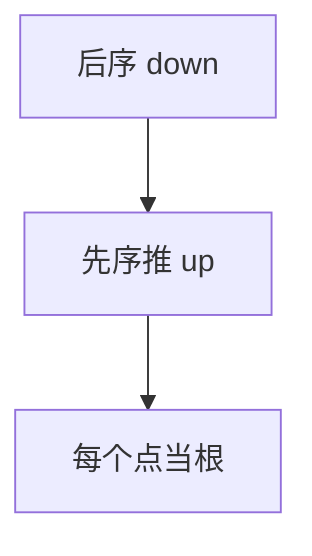

# 换根 DP

先定根做一次树形 DP，再第二次 DFS 把「来自父亲的贡献」推到每个点，使每个顶点当根的答案 $O(n)$ 齐。

<footer>—— 据树形 DP 二次扫描的标准技法；[树形 DP](/cs/tree-dp) 整理</footer>

上一课[插头 DP](/cs/plug-dp)在网格轮廓。树上一问「每个点当根时的最优/距离和」，朴素 $n$ 次树 DP 是 $O(n^2)$。缺口是换根（rerooting）：一次下、一次上。不重写后序独立集。后课 LIS/LCS 换序列。

## 问题

例：每个点到其它点的距离和。先以 $1$ 为根算子树大小与子树内距离和；换到孩子 $v$ 时，用 $n-2\cdot sz[v]$ 一类公式改距离和。一般：`up[v]` 表示除 $v$ 子树外的信息，由父亲的 `up` 与兄弟合并。

缺口是第二次 DFS，不是点分治点对。

### 合并要可减或可补

若孩子贡献不能从总和里拆出（不可逆运算），换根要维护「去掉一个孩子」的结构，可能多 $\log$。可结合、可删才 $O(n)$。

二次扫描是树 DP 标准。与点分治：换根给每个点当根的全局量；点分治给路径计数。后课 LIS 离开树。

## 方法

第一遍后序 `down[u]`。第二遍先序：用 `down` 与 `up[u]` 拼 `ans[u]`，再算每个孩子的 `up[v]`。兄弟前缀/后缀和便于 $O(deg)$ 合计仍 $O(n)$。

换根公式先在纸上对一条边 $(u,v)$ 写清。

## 机制

树去边成两棵，信息在边上重接。与 HLD：HLD 管路径查询数据结构；换根是一次性全体根。与重心：重心是结构点，换根是答案平移。

## 边界

本课不写带修改换根。有环先缩点。后课默认：全体根上的树 DP 用二次 DFS。下一课 LIS 与 LCS。

## 小结

- 下 DP + 上推父亲贡献 = 全体根 $O(n)$。
- 合并须能拆开一个孩子。
- 不是 $n$ 次独立树 DP。
- 出处：树形 DP 二次扫描标准技法。
