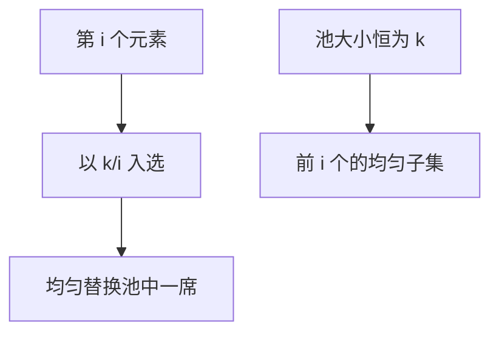

# 蓄水池抽样

流长度事先不知道：前 $k$ 个全进池，第 $i$ 个以 $k/i$ 替换池中均匀一个；结束时每个元素等概率在池里。

<footer>—— 据 Vitter, Random Sampling with a Reservoir, ACM TOMS 1985；Knuth, TAOCP 卷 2 整理</footer>

[上一课](/cs/minhash-lsh) 假定能扫集合或签名。[数组](/cs/array-random-access) 已知 $n$ 可直接抽下标。数据流、日志一行行来，$n$ 未知或太大。本课不入 LSH 桶。缺口是蓄水池：固定 $k$ 个槽，单遍均匀样本。

## 问题

要大小 $k$ 的无放回均匀子集（或每个位置等概率）。若 $n$ 知，Fisher–Yates 前 $k$ 即可。$n$ 不知：Algorithm R：遇到第 $i$ 个（$i\gt k$），以 $k/i$ 决定是否入选，入选则均匀替换池中一席。归纳：看完 $i$ 个后池是前 $i$ 个的均匀 $k$ 子集。缺口是**用递推概率代替预先 $n$**。

Vitter, *ACM Trans. Math. Software*, 1985，含跳过几何随机数的加速。Knuth 卷 2 抽样。加权蓄水池（Efraimidis）点名不展开。

## 方法

实现注意 $i$ 用浮点算 $k/i$ 的精度，或用整数技巧。跳过：一次生成「下一个替换发生在哪」，少抛硬币。并行：多机蓄水池再合并要加权，不是简单拼接。

与 HLL：HLL 不保留元素；蓄水池保留真实记录便于事后分析。与 CM：CM 估频次不给均匀样本。

## 机制

证明对 $i$ 归纳：老元素留在池中的概率正确下降。第 $i$ 个进入概率 $k/i$，对称性得均匀。不要在未知 $n$ 时先 `list.append` 再 `random.choice`——那不是流算法。

分位数要的是分布形状不是均匀元素：下一课 t-digest。

## 边界

本课不写分布式精确合并的全部协议。有放回、滑动窗口蓄水池是变体。不要抽「限价簿订单」当例子——本栏避开 LOB。

后课默认：未知 $n$ 均匀 $k$ 样本用蓄水池。流上分位数用 t-digest。

## 小结

- 蓄水池：单遍、固定 $k$、均匀。
- 第 $i$ 个以 $k/i$ 替换。
- 下一课近似分位数摘要。
- 出处：Vitter, *TOMS*, 1985；Knuth 卷 2。
