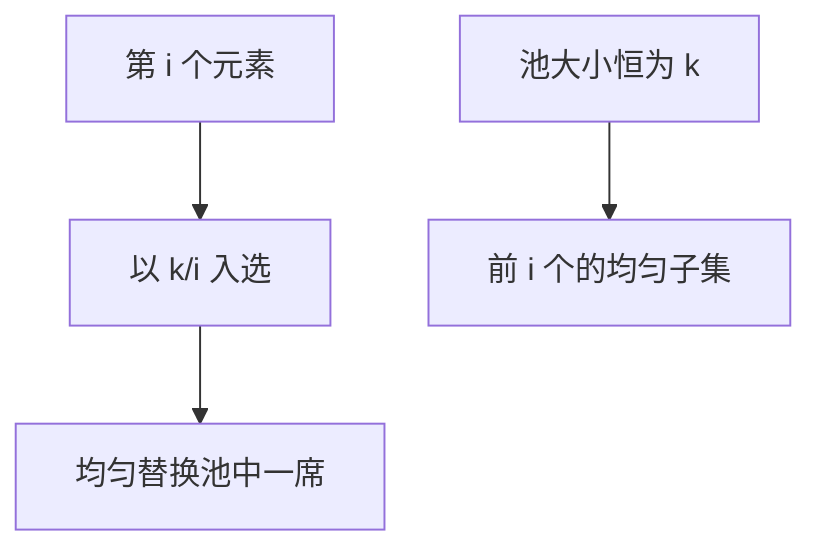
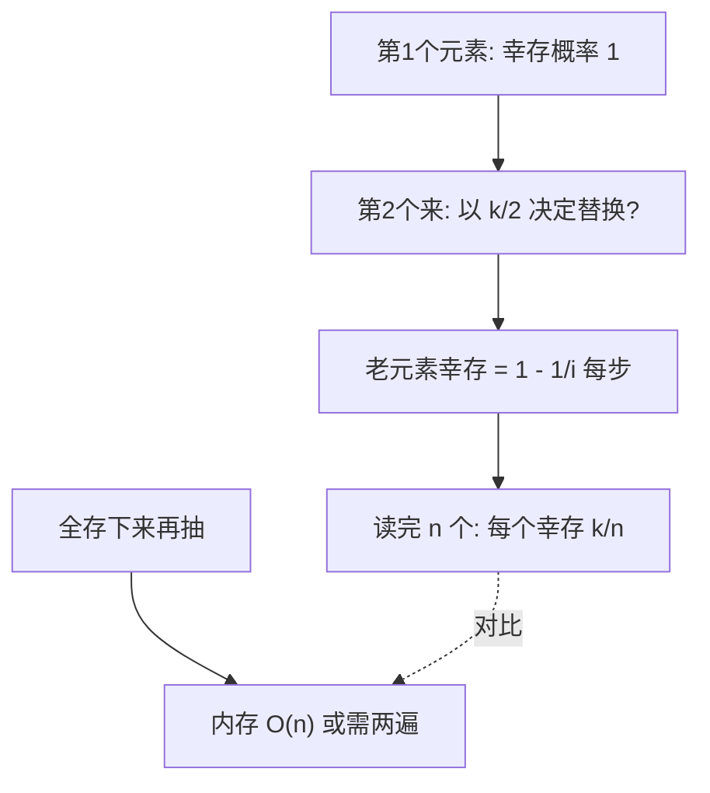

# 蓄水池抽样

流长度事先不知道：前 $k$ 个全进池，第 $i$ 个以 $k/i$ 替换池中均匀一个；结束时每个元素等概率在池里。

<footer>—— 据 Vitter, Random Sampling with a Reservoir, ACM TOMS 1985；Knuth, TAOCP 卷 2 整理</footer>

[上一课](/cs/minhash-lsh) 假定能扫集合或签名。[数组](/cs/array-random-access) 已知 $n$ 可直接抽下标。数据流、日志一行行来，$n$ 未知或太大。本课不入 LSH 桶。缺口是蓄水池：固定 $k$ 个槽，单遍均匀样本。

## 问题

要大小 $k$ 的无放回均匀子集（或每个位置等概率）。若 $n$ 知，Fisher–Yates 前 $k$ 即可。$n$ 不知：Algorithm R：遇到第 $i$ 个（$i\gt k$），以 $k/i$ 决定是否入选，入选则均匀替换池中一席。归纳：看完 $i$ 个后池是前 $i$ 个的均匀 $k$ 子集。缺口是**用递推概率代替预先 $n$**。

Vitter, *ACM Trans. Math. Software*, 1985，含跳过几何随机数的加速。Knuth 卷 2 抽样。加权蓄水池（Efraimidis）点名不展开。

## 方法

实现注意 $i$ 用浮点算 $k/i$ 的精度，或用整数技巧。跳过：一次生成「下一个替换发生在哪」，少抛硬币。并行：多机蓄水池再合并要加权，不是简单拼接。

数字实例：$k=1$ 时算法退化成「英雄之旅」：第 1 个直接入池，第 2 个以 $1/2$ 取代它，第 3 个以 $1/3$，第 4 个以 $1/4$……读到最后，每个元素恰好以 $1/n$ 当选——第 1 个元素幸存概率 $= \frac{1}{2}\cdot\frac{2}{3}\cdot\frac{3}{4}\cdots\frac{n-1}{n} = \frac{1}{n}$，中间项全对消。

常见误区：初学者容易以为替换概率该恒定（比如总用 $1/2$ 抛硬币）。恒定概率会让先来者劣势或优势失衡；正确直觉是「越晚到的候选越少，但它竞争的对手池越强」，$k/i$ 的递减正是让新老元素在任何时刻胜率都相等的唯一解。

```mermaid
flowchart TD
  I["第 i 个元素"] --> P["以 k/i 入选"]
  P --> REP["均匀替换池中一席"]
  POOL["池大小恒为 k"] --> UNIF["前 i 个的均匀子集"]
```

与 HLL：HLL 不保留元素；蓄水池保留真实记录便于事后分析。与 CM：CM 估频次不给均匀样本。

## 机制

证明对 $i$ 归纳：老元素留在池中的概率正确下降。第 $i$ 个进入概率 $k/i$，对称性得均匀。不要在未知 $n$ 时先 `list.append` 再 `random.choice`——那不是流算法。

```mermaid
flowchart TD
  A["第1个元素: 幸存概率 1"] --> B["第2个来: 以 k/2 决定替换?"]
  B --> C["老元素幸存 = 1 - 1/i 每步"]
  C --> D["读完 n 个: 每个幸存 k/n"]
  A2["全存下来再抽"] --> M["内存 O(n) 或需两遍"]
  D -.对比.-> M
```

这张图回答的问题是「为什么一遍流就能得到与全存下来再抽完全相同的分布」：把每个元素在池中的幸存概率连乘，$k=1$ 时第 1 个元素的 $\frac{1}{2}\cdot\frac{2}{3}\cdots\frac{n-1}{n}$ 全部对消成 $1/n$；一般 $k$ 时同型连乘给出 $k/n$——均匀性是连乘的推论，不需要先知道 $n$。

为什么重要：这一步如果做错了（比如流上先 `append` 全部再随机选），日志一大就得落盘两次或内存爆掉；而蓄水池只占 $k$ 个槽、只扫一遍，代价是必须接受「边读边淘汰」——两者输出的分布在数学上完全一样。

分位数要的是分布形状不是均匀元素：下一课 t-digest。

## 边界

本课不写分布式精确合并的全部协议。有放回、滑动窗口蓄水池是变体。

后课默认：未知 $n$ 均匀 $k$ 样本用蓄水池。流上分位数用 t-digest。

## 小结

- 蓄水池：单遍、固定 $k$、均匀。
- 第 $i$ 个以 $k/i$ 替换。
- 下一课近似分位数摘要。
- 出处：Vitter, *TOMS*, 1985；Knuth 卷 2。
