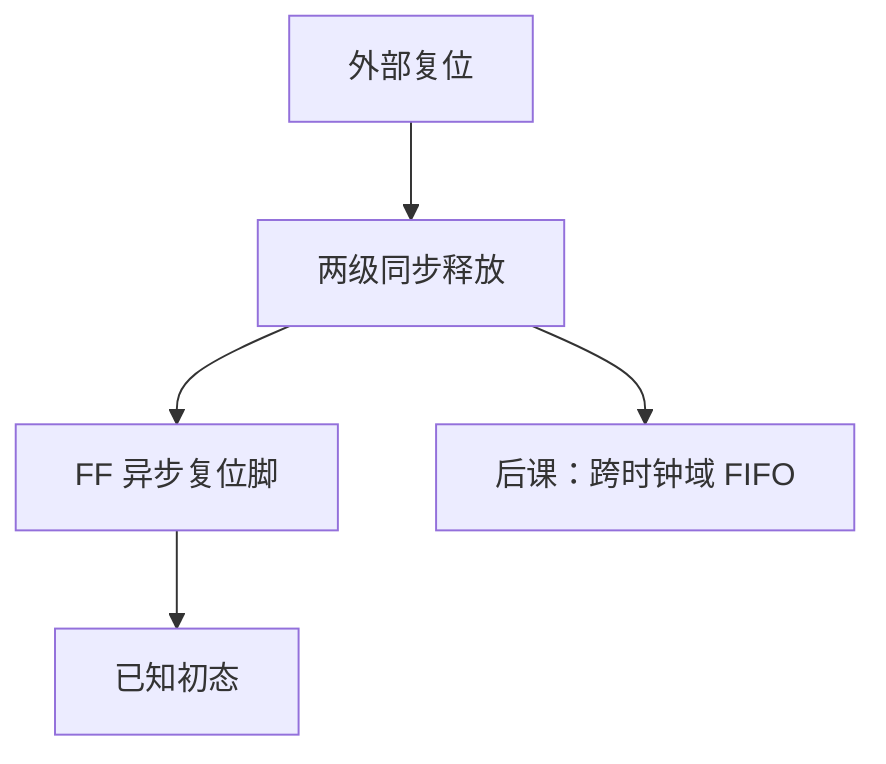

# 复位策略

  
复位要让状态机进已知态，但释放沿必须相对于时钟可预测：异步断言、同步释放是常见折中，否则恢复时间与偏斜会在上电时制造幽灵状态。

  <footer>—— 据 Cummings, Synthesizable Finite State Machine Design Techniques Using the New SystemVerilog 3.0, SNUG；Harris and Harris, Digital Design and Computer Architecture 整理</footer>

[上一课](/cs/clock-skew-cts)让每个 FF 的时钟到达时间变成数字。复位是另一根全局网：它也要树，也有偏斜。缺口是**复位策略**——异步还是同步、如何释放——否则 STA 的恢复/移除检查与上电行为对不齐。

## 问题

异步复位：`always @(posedge clk or negedge rst_n)`，断言立刻清 Q，不依赖时钟，上电友好。释放时 `rst_n` 相对 `clk` 若落在恢复窗口，FF 亚稳——与[建立保持](/cs/setup-hold)同类窗口，名字叫 recovery/removal。同步复位：只在边沿采样复位，释放自然对齐时钟，但断言也要等时钟，时钟未振时清不掉。缺口不是再讲 CTS，而是这两类复位如何接、如何把释放同步化。

常用：异步断言、经两级 FF **同步释放**，再送到各异步复位脚。复位树同样要 CTS 一类平衡。

### 每个寄存器都异步复位不是免费

面积、布线、复位树功耗、以及「故意不复位」的流水线数据寄存器（下一拍会被有效数据覆盖）。全芯片异步复位会让综合插入大量复位端口。把「好设计=处处复位」当成教条，时序与布线会胀。

Cummings 的 FSM 与复位风格文章是 RTL 实践来源。Harris 给出异步复位模板。本课不把上电复位芯片内部模拟电路画完。

## 方法

外部 `rst_n` 异步来。同步器（两级 FF，时钟已稳定后）产生内部 `rst_n_sync`。消费端：异步复位脚接 `rst_n_sync`，释放已与时钟同源。需要完全同步复位的路径只用数据端 MUX。扫描测试时复位可被 DFT 改接，后课扫描链再钉。

多时钟域：每个域自己同步释放，不要把 A 域已释放的复位直接异步灌进 B 域。

## 机制

下一课异步 FIFO 处理数据跨域；复位跨域同样要按域同步，否则 FIFO 指针的初值在两边不是「同时」变零。STA：声明复位为时序检查对象（recovery），或把异步复位路径设为假路径并依赖同步释放结构——约束必须匹配 RTL。

## 边界

本课不讲上电复位（POR）带隙电路，不把看门狗当成复位策略的全部。不讨论部分复位（只复位外设子系统）的电源域细节，留给后课功耗/电源。

后课默认：复位异步断言、同步释放；每时钟域各有同步后的复位。

## 小结

- 异步断言方便上电；释放必须相对时钟过恢复窗口。
- 两级同步释放是常用结构；复位树也有偏斜。
- 跨域复位与跨域数据一样要同步。
- 出处：Cummings SNUG；Harris and Harris。
