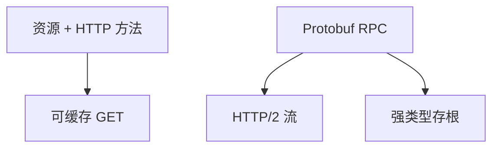

# REST 与 gRPC

REST 用资源 URI 与 HTTP 方法约束接口；gRPC 用 HTTP/2 流跑 Protobuf RPC。都是应用合同，不是新的运输层。

<footer>—— 据 Fielding 博士论文 REST；gRPC 超 HTTP/2 实践；RFC 9110 整理</footer>

[HTTP 语义](/cs/http-semantics) 给方法。[上一课](/cs/sse-server-push) 是一种推。缺口是**两种常见 API 风格**：REST 资源 vs gRPC 过程调用。本课不把 Protobuf 编码写完，下一课写。

## 问题

浏览器与公开 API 适合 REST：GET 可缓存、幂等合同清晰。微服务内部适合 gRPC：存根、流式 RPC、强类型。gRPC 默认 H2，浏览器要 grpc-web。REST 不是「用了 JSON 就 REST」：要统一接口与超媒体约束，课上钉常见子集。错误：REST 用状态码，gRPC 用 status 与 trailer。

不要把 gRPC 写成 QUIC 专属；H3 上的 gRPC 在演进。

Fielding 2000。gRPC 文档。本课对照，不教框架安装。

### 合同不是运输

REST 面向资源与缓存；gRPC 面向 RPC 与流。浏览器与公开 API 偏好前者。LB 要不要终止 H2 因此分叉。

## 方法

对照：资源/方法 vs 服务/方法；缓存；浏览器；流。画：客户端 → HTTP → 资源；客户端 → H2 流 → RPC。与 WS：全双工消息 vs RPC 流。

方法止于选定对象与对照；机制才说它如何嵌入已有分层与主干课。

## 机制

负载均衡：REST 可 L7 看路径；gRPC 看服务与方法，要 H2 感知 LB。Cookie 少用于 gRPC，多用 token 头。超时与重试：REST 靠幂等头，gRPC 有 deadline，后课幂等会收。内容协商在 REST 常见，gRPC 固定编码。

与端到端：两种都要应用层校验，HTTP 成功不等于业务成功。

## 边界

本课不引入 GraphQL 的全部。序列化 JSON/Protobuf 是下一课。后课默认：REST 面向资源与缓存；gRPC 面向 RPC 与流。

公开互联网 API 强推 gRPC 会挡浏览器与缓存。

上一课留下的缺口在本课收口；「REST 与 gRPC」进入后课词汇表后只引用。文献用来钉对象与边界，不把本课写成该主题的独立综述。下一课[序列化：JSON / Protobuf](/cs/serialization-protobuf)。

## 小结

- REST：资源、方法、缓存合同。
- gRPC：H2 上的 RPC 与流。
- LB、浏览器、缓存需求不同。
- 后课只引用本课钉死的对象，不从该领域总问题重开。
- 出处：Fielding REST；gRPC over HTTP/2。
