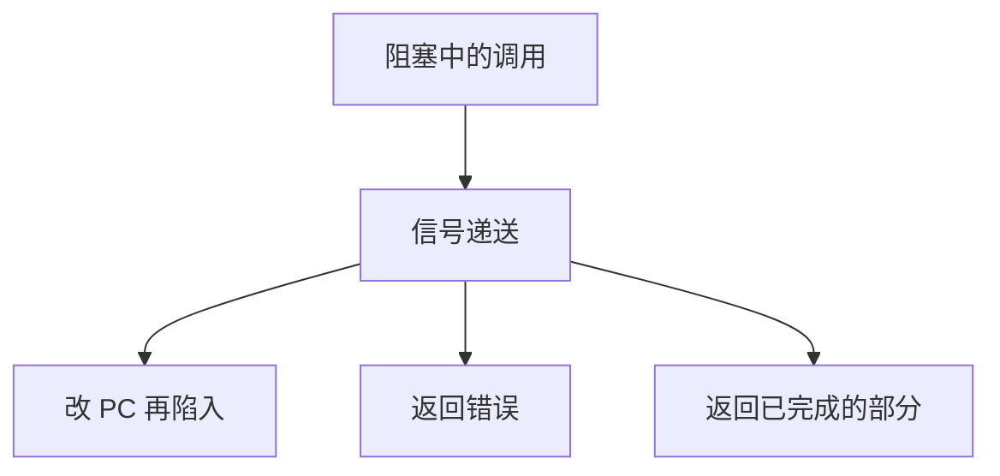

# 重启系统调用

可中断的慢系统调用被信号拽回用户态时，要么返回错误让库重试，要么由内核把 PC 拨回陷入指令再做一次。

<footer>—— 据 Stevens and Rago, Advanced Programming in the UNIX Environment；Tanenbaum MOS 整理</footer>

[上一课](/cs/copy-from-user)让入参进了内核副本，拷贝与实现都可以睡眠。[信号](/cs/signals)会在返回用户前递送。缺口是：阻塞在 `read`、`wait` 上的线程被信号叫醒后，**这次系统调用算完成、算失败，还是算没发生**。本课钉重启约定，不重讲信号掩码。

## 问题

若一律返回「已做完」，调用方会把短读、未完成的 `wait` 当成功。若一律失败且不可重试，慢调用无法写成长逻辑。Unix 的折中：许多调用返回 `EINTR`，由用户库或程序决定是否重来；另一些在 `SA_RESTART` 一类标志下，内核把用户 PC 调回陷入指令，等于按原 ABI 再走一遍[系统调用路径](/cs/syscall-path)。缺口是这条重启纪律，不是新的拷贝例程。

本课不把 POSIX 里每一条「哪些调用可重启」的表背完。

已经发生的副作用不能偷偷撤销：部分写入的字节已经在管道里。重启只适用于「要么没做、要么明确失败」的那一类，或由调用方对短操作自行循环。

## 方法

睡眠点被信号打断：若用户要求重启且该调用无不可逆副作用，则修改 trapframe 中的 PC（与必要时的调用号寄存器），返回用户后下一条就是原来的陷入。否则把错误码写入返回值槽，PC 指向陷入的下一条，由 libc 译成 `EINTR`。部分成功（短读）通常不当成重启对象：返回已传字节数。

## 机制

重启把「用户可见的一次 `read`」与「内核内部被叫醒一次」分开。没有它，每个阻塞调用都要把信号检查写进应用循环。有了它，应用仍须处理短读写：重启不是无限重试直到满缓冲。与[上下文切换](/cs/context-switch)的关系：叫醒走唤醒，是否重启是返回用户前对 trapframe 的修补。

拷贝已经成功的入参，重启时会再拷一次；这是可接受的重复，前提是用户指针语义仍成立。

## 边界

本课不把实时信号排队、`signalfd` 写成另一接口课。也不讨论调试器单步时如何伪造重启。连接套接字上的超时与信号是后课网络路径，这里只保留 EINTR/重启二分。

后课默认：慢调用可被信号打断，重启或 `EINTR` 是 ABI 的一部分。若要把整条路径暴露给调试器与跟踪器，下一课讲跟踪与 ptrace 入口。

## 小结

- 信号可打断睡眠中的系统调用；重启或 `EINTR` 必须说清。
- 已发生的副作用不能假装没发生。
- 把路径暴露给跟踪器是下一课。
- 出处：Stevens and Rago, *APUE*；Tanenbaum and Bos, *MOS*。
