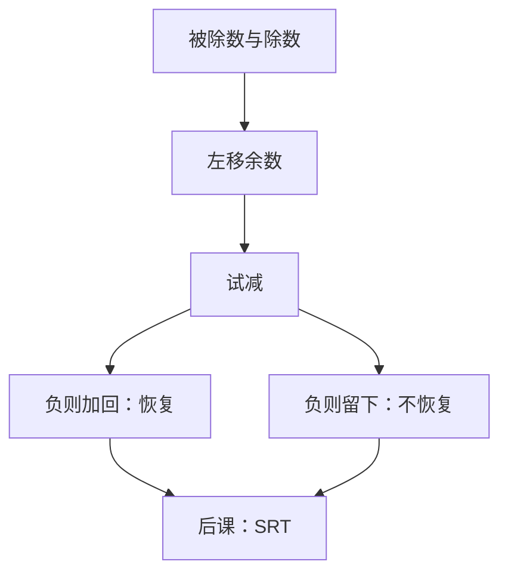

# 恢复与不恢复除法

  
除法是乘法的逆：每步试减，够则商 1，不够则商 0；不够时要不要把减回去，分开两种数据通路。

  <footer>—— 据 Harris and Harris, Digital Design and Computer Architecture；Patterson and Hennessy, Computer Organization and Design (RISC-V) 整理</footer>

[上一课](/cs/wallace-carry-save)把乘法收成部分积压缩加一次 CLA。乘是多操作数加；除没有对称的「部分商树」可一次铺开（商的每一位依赖前一位试减结果）。缺口是：**整数除**的移位–减循环，以及恢复与不恢复两种写法。

## 问题

无符号 $N\div D$：余数寄存器初始化为 $N$（或高位置 0），每步左移，减 $D$。若结果非负，商位移 1，余数采用减法结果；若为负，商位移 0——恢复除法把 $D$ 加回去，不恢复除法则留下负余数、下一步改加 $D$（因为多减了一次）。缺口不是再定义商与余，而是电路：同一套加法器，$c_0$ 与 $B$ 反相在加/减之间切换。

本课钉移位减。SRT 用冗余商数字加速，是下一课的缺口。

### 恢复不是「软件里 if 再加回去」的另一套语义

两种算法算出同一无符号商与非负余数（最后一步不恢复法若余数为负须加回 $D$）。差别是中间余数是否允许为负、加法器每拍是否多一次加。把它们当成两种不同的除法定义，后课 SRT 的冗余数字会对不齐。

Harris 用恢复/不恢复对照。Patterson/Hennessy 把除法延迟写成 $\Theta(n)$ 拍，与组合乘对照。Ercegovac and Lang, *Digital Arithmetic* 是算术单元的系统参考，本课范围停在这两种经典迭代。

## 方法

寄存器：余数 $R$（可 $2n$ 位）、除数 $D$、商 $Q$。每拍：$R\leftarrow 2R$，试 $R-D$。恢复：负则 $R\leftarrow R+D$，商比特 0。不恢复：负则下一步做 $R+D$，正则继续 $R-D$，商比特为符号的反。$n$ 拍后得到 $n$ 位商。补码有符号除要先处理符号或改用非恢复的符号规则，本课以无符号钉通路。

与[阵列乘法](/cs/array-multiplier)对照：乘可组合树；除的每位商有循环进位依赖，教学实现几乎总是多周期。

## 机制

RV32M 的 `div`/`rem` 可以走这条迭代单元，与 `mul` 分时同一加法器或分单元。除零与溢出（有符号最小负数除 $-1$）是 ISA 规定的结果或旗标，本课承认要检测，不把陷阱入口写进算术单元。余数符号随被除数的约定（向零截断 vs 向负无穷）是语言/ISA 选择，硬件按选定的恒等式收尾。

## 边界

本课不引入商数字集 $\{\bar 1,0,1\}$，不讲 Goldschmidt/Newton 迭代。也不把浮点除的对阶与规格化画进来。阵列除法器存在，面积与 $n^2$ 级，组成课通常不采用。

后课默认：整数除是移位–试减；$n$ 拍量级；恢复与不恢复只改中间余数与加减选择。

## 小结

- 乘法已能一棵树压完；除法每位商依赖试减，走迭代。
- 恢复：不够则加回；不恢复：负余数用下一步加法补偿。
- 除零与有符号溢出按 ISA 收，不在本课展开陷阱。
- 出处：Harris and Harris；Patterson and Hennessy, COD (RISC-V)；Ercegovac and Lang, *Digital Arithmetic*。
