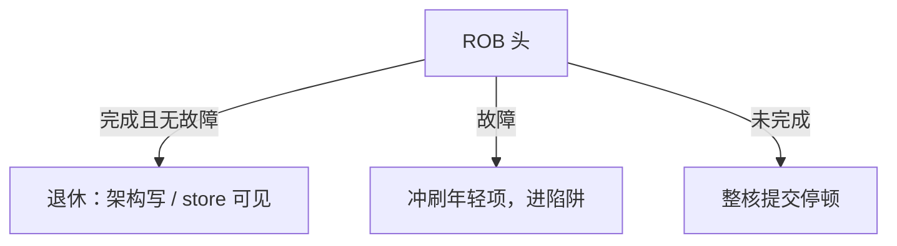

# 退休与精确异常

乱序可以乱算，对程序员可见的写必须按程序序提交；异常发生时，那条指令之前全部完成、之后全部像没发生。

<footer>—— 据 Smith and Pleszkun, Implementing Precise Interrupts in Pipelined Processors, ISCA 1985 整理</footer>

[上一课](/cs/macro-micro-fusion)让内部 uop 数可以少于 ISA 条数，但调试与 trap 仍要按指令边界说话。[ROB](/cs/ooo-rob) 与[推测恢复](/cs/speculation-recovery) 已经给出冲刷通道。本课不重讲融合白名单。缺口是把**退休（retire / commit）当作架构状态的唯一入口**，并钉精确异常与中断在乱序核上的含义。

## 问题

五级流水的异常可以在某一级「当场停、当场改 PC」。乱序里年轻 `add` 可能已经写了物理寄存器，年长 `load` 才缺页。若把物理堆当成架构堆，处理程序会看见未来的 `x1`。缺口不是再加一个 IQ，而是**只有 ROB 头完成且无异常时，才把结果变成架构可见**——包括整数寄存器、store 对 cache、CSR 副作用。

Smith–Pleszkun 给出 ROB、未来文件、历史缓冲三条路。当代乱序核用 ROB + 物理寄存器堆：提交时更新架构映射或释放旧物理号，store 此刻才离开 SQ。

## 方法

每拍检查 ROB 头最多 $R$ 条：已执行完毕、无故障则退休——写架构可见状态、释放 [PRF](/cs/prf-free-list) 旧槽、弹出 LQ/SQ 头。头指令故障：冲刷头之后全部，把异常 PC 与原因交给特权入口，与[流水线异常](/cs/pipeline-exception) 的精确性定义一致。中断：等到一个精确边界（通常某条已退休之后）再插入。

## 机制

提交带宽 $R$ 是第五个窗口上限：执行再快，头被长延迟 load 堵住则 ROB 满，前端停。这与「精确」不可分割：不允许头后面的 store 先可见来「缓解」堵住——那会破坏精确性与 [MESI](/cs/mesi-protocol) 的提交即全局。

[融合](/cs/macro-micro-fusion) 的指令必须在其架构边界上一次退休或一次 trap：不能出现「比较已经架构可见、分支还在 ROB 里」的半态，除非 ISA 把它们定义成一条。

## 边界

本课不把 Linux 的 trap 处理、信号帧写进来，那是 OS 课。也不处理非精确的浮点状态位实现（有的 ISA 允许推迟）。深流水把核对点推远，退休相对 IF 的距离变长，下一课才谈频率与级深。

后课默认：架构状态只在退休时变；异常精确 = ROB 头纪律。级越深，同一误预测扔掉的投机量越大。

## 小结

- 退休是架构写的唯一门；异常在 ROB 头精确。
- 提交宽度与头阻塞决定何时窗口满。
- 级深与时钟的交易是下一课。
- 出处：Smith and Pleszkun, *ISCA*, 1985；Hennessy and Patterson, *CA:AQA*。
