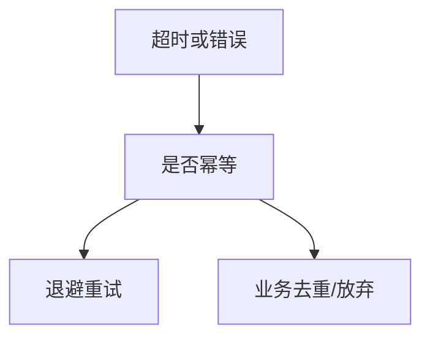

# 重试与幂等

超时后重试可能让「一次」变成「两次」；只有幂等或带幂等键的请求才能自动重放，否则要业务去重。

<footer>—— 据 RFC 9110 方法幂等；gRPC retry 实践整理</footer>

[HTTP 语义](/cs/http-semantics) 已钉 GET 幂等。[心跳超时](/cs/heartbeat-timeout) 触发重试。[QUIC 0-RTT](/cs/quic-streams-0rtt) 有重放。[上一课](/cs/heartbeat-timeout) 留下失败之后。缺口是**何时可自动重试**。本课不把背压写完。

## 问题

LB 摘除、无线丢、超时：客户端想再来一次。GET/PUT 幂等可重试；POST 扣款不行，除非 Idempotency-Key。指数退避 + 抖动防惊群（与 TCP RTO 同形）。gRPC 可对 UNAVAILABLE 重试。0-RTT 只给安全方法。服务端必须去重，因「至少一次」交付。

不要把 TCP 重传算作应用重试：那是同一段。

RFC 9110。键的存储寿命要覆盖重试窗。

### 运输重传不是应用重试

GET 可自动放；POST 要键或去重。退避加抖动有上限。无限重试是自我 DoS。0-RTT 只给安全方法。

## 方法

对照：至少一次 / 至多一次 / 恰好一次（难）。画：失败 → 是否幂等 → 退避重试。与 SYN 重传对照。

方法止于选定对象与对照；机制才说它如何嵌入已有分层与主干课。

## 机制

反向代理重试 GET 要防非幂等被标错方法。Maglev 换后端可能双处理。DNS 切换中重试打到新旧两源。邮件 SMTP 已有队列重试，要 DSN。

安全：重试放大失败成洪泛，要预算。

## 边界

本课不引入 saga 补偿的全部。应用层背压是下一课。后课默认：自动重试仅幂等；否则键或人工。

无限重试等于自己做 DoS。

上一课留下的缺口在本课收口；「重试与幂等」进入后课词汇表后只引用。文献用来钉对象与边界，不把本课写成该主题的独立综述。下一课[应用层背压](/cs/app-backpressure)。

## 小结

- 运输重传 ≠ 应用重试。
- 幂等或幂等键才能自动放。
- 退避加抖动，且有上限。
- 后课只引用本课钉死的对象，不从该领域总问题重开。
- 出处：RFC 9110；RPC 实践。
