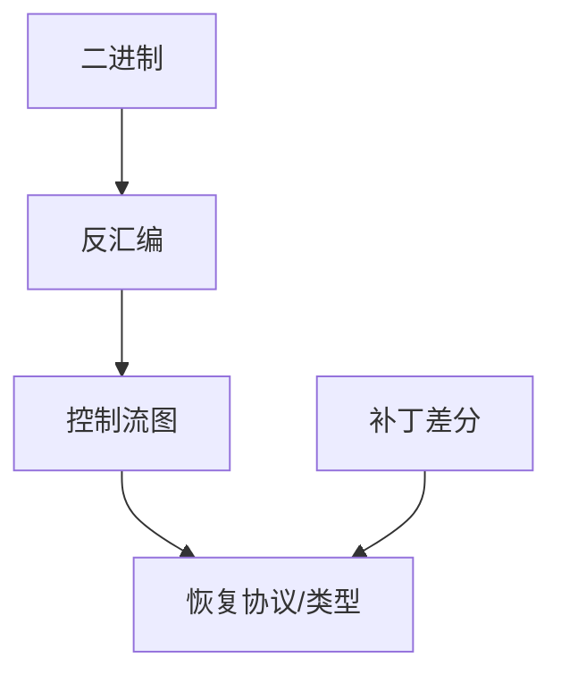

# 逆向工程

没有源码时，行为仍在指令与数据里。逆向是恢复类型、协议与不变量，用来做兼容、审计与补丁理解。它不是默认的利用课。

<footer>—— 据 Cifuentes 的反编译；Hex-Rays/Ghidra 类工具的公开文档；对照版权与许可边界</footer>

## 定位

上一课[补丁](/cs/patch-management)有时只有二进制差分。缺口是**如何读差分**：反汇编、控制流图、字符串。本课讲方法与合法用途，不提供破解授权或写恶意载荷。

后课默认已经读完本课钉下的合同，只补差，不从该领域第一性原理重开。

## 问题

供应商闭源、固件、恶意软件（下一课）。静态：反汇编；动态：调试器。缺口是抽象恢复，不是绕过付费墙。

### 许可

拆自己的产物、授权审计、恶意软件分析是常见合法语境。拆他人保护机制可能违法——本课不指导后者。

Ghidra 是 NSA 开源逆向套件。本课不给破解练习。

## 方法

列视图：CFG、交叉引用、系统调用。对照符号执行辅助理解。下一课恶意软件分析：同样的工具，目标是分类与遏制。

图中节点是本课的机制骨架；课程不把图展开成可运行的攻击步骤。

## 机制

理解闭源是防御的输入。下一课把对象换成恶意软件样本。

前提写进合同之后，游戏外的误用只当失败模式点名，不在本课写成操作程序。

## 边界

本课不写 DRM 绕过。恶意软件分析下一课。

## 小结

- N-day 理解常要读二进制差分。
- 逆向恢复行为，服务审计与兼容。
- 不指导破坏他人保护机制。
- 下一课恶意软件分析。
- 出处：Cifuentes；Ghidra 文档；对照 Anderson 对逆向的讨论。
