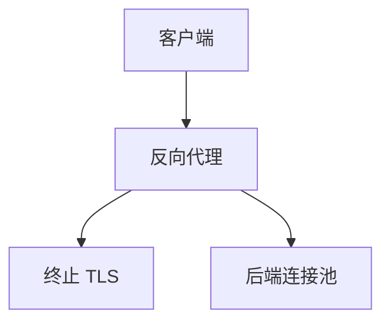

# 反向代理

客户端只看见代理；代理终止 TLS、补头、缓存、再开到后端的连接。它是 L7 的具体形态，不是又一种路由协议。

<footer>—— 据 RFC 9110 网关/代理；HTTP 实践整理</footer>

[L7 LB](/cs/l4-l7-load-balancing) 常以反向代理实现。[CDN](/cs/cdn-cache-hierarchy) 边缘也是。[上一课](/cs/maglev-lb) 可把流量先送到代理层。缺口是**代理职责**：Hop-by-hop 头、连接复用、缓冲。本课不把服务发现写完。

## 问题

浏览器不直连应用进程。反向代理：证书、HTTP/1.1 到后端 H2 的转换、压缩、WAF、限流令牌桶。`X-Forwarded-For` 传原 IP，信任边界要钉。缓冲：代理若把 SSE 攒满再发，实时死——接 SSE 课。WS 要 Upgrade 透传。

不要把反向代理写成正向代理（客户端配置出去）。

RFC 9110 定义 proxy/gateway。本课不点名 nginx 配置项当标准。

### 面向客户的网关

终止 TLS、改头、池化后端。hop-by-hop 头不盲目转发。缓冲会杀 SSE。与正向代理方向相反。

## 方法

画：客户 → 代理（TLS 终）→ 后端池。对照 Maglev 纯 L4：不终结 TLS。与 SSH 反向隧道不同方向。

方法止于选定对象与对照；机制才说它如何嵌入已有分层与主干课。

## 机制

连接池摊销后端握手，像 HTTP 持久。TSO 在代理两侧。健康检查由代理做。Cookie 会话可钉后端。QUIC 在代理终止，后端常 HTTP/1.1。PMTUD 在两段各自发生。

安全：代理是集中点，配置错误会泄露内网。

## 边界

本课不引入缓存键的全部边角。服务发现是下一课。后课默认：反向代理终结客户协议并转发；hop-by-hop 头不盲目转发。

把代理超时设太短会拆合法 SSE/WS。

上一课留下的缺口在本课收口；「反向代理」进入后课词汇表后只引用。文献用来钉对象与边界，不把本课写成该主题的独立综述。下一课[服务发现](/cs/service-discovery)。

## 小结

- 反向代理是面向客户的 L7 网关。
- 管 TLS、头、池、缓冲。
- 与纯 L4 Maglev 分层。
- 后课只引用本课钉死的对象，不从该领域总问题重开。
- 出处：RFC 9110；HTTP 网关实践。
