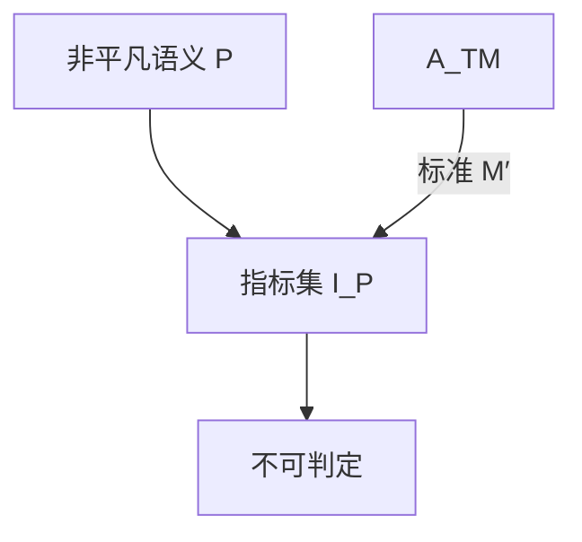

# Rice 定理

任何关于 $L(M)$ 的非平凡语义性质，作为机器编码的集合，都不可判定。

<footer>—— 据 Rice, Classes of Recursively Enumerable Sets and Their Decision Problems, 1953 整理</footer>

上一课[映射归约](/cs/mapping-reduction-undecidable)会逐个构造 $M'$。缺口是批量：只要性质谈的是**语言**而不是代码文本，并且不是「所有 RE 都是 / 都不是」，就不可判定。Rice 定理收掉「是否空、是否有限、是否等于 $\Sigma^*$、是否正则」这一类。

## 问题

性质 $P$ 是一组 RE 语言。对应的指标集 $I_P=\{\langle M\rangle\mid L(M)\in P\}$。非平凡：存在 $M_1,M_2$，$L(M_1)\in P$、$L(M_2)\notin P$。Rice：每个这样的 $I_P$ 不可判定。证明骨架：把 $A_{\mathrm{TM}}$ 化到 $I_P$。不妨设 $\emptyset\notin P$（否则做补）。取固定的 $M_+$ 使 $L(M_+)\in P$。给定 $\langle M,w\rangle$，造 $M'$：先模拟 $M(w)$，若接受再模拟 $M_+$。则 $L(M')=L(M_+)$ 或 $\emptyset$，于是 $\langle M'\rangle\in I_P\iff M$ 接受 $w$。

句法性质不在范围内：「$M$ 是否恰有 5 个状态」可判定。语义是外延 $L(M)$。

### 非平凡不能省

「$L(M)$ 是 RE」是平凡的：所有 $M$ 都是。平凡性质可判定（恒真或恒假）。Rice 不管复杂度，也不给出是否 RE。

Rice 1953。课堂常证「不可判定」这一半；Rice–Shapiro 等加强到 RE 指标集的形状，本课不进。与停机的差别：停机不是纯语言性质（依赖具体 $w$ 上的运行）。

## 方法

核对：问的是不是 $L(M)$？有没有正反例？有则直接引 Rice，不必新造对角化。若问的是「在输入 $0$ 上是否停」，不是纯语义，回到归约。

[CFG 等价](/cs/cfg-grammar) 在主干不可判定，那是文法对象；本课对象是 TM 指标。不要用 Rice 去打 DFA 等价——DFA 的语言性质许多可判定，因为描述不是通用 TM。

## 机制

定理依赖通用模拟：才能让 $M'$ 在「先做 $M(w)$」之后变成另一台已知机器。有限自动机没有这种通用性，Rice 不适用。这解释为何词法器可以判定等价，而任意程序不能判定「是否认同一语言」。

Rice 不阻止近似、静态分析、受限语言上的判定；它阻止的是全 TM 类上的精确语义问题。

「$M$ 是否在输入 $\varepsilon$ 上三步内停」不是语义：$L(M)$ 相同的机器可以在 $\varepsilon$ 上行为不同（若谈的是具体运行）。Rice 只管外延。指标集可以不可判定却仍 RE（如 $A_{\mathrm{TM}}$ 投影），也可以两边都不是 RE。定理只给不可判定这一口。

## 边界

本课不证指标集是否 RE（有的是，有的连补都不是）。不引入 Rice 的全部推广。后课默认：见「任意程序的语言是否满足……」先查 Rice。下一课自指：递归定理。

受限程序分析（有限展开、抽象解释）可以对子类给答案，并不违反 Rice：它们放弃了全 TM 类上的精确语义。本课只禁止「任意程序 + 非平凡外延性质」的判定器。

## 小结

- 非平凡的 $L(M)$ 性质不可判定。
- 句法、特定输入上的运行，不在定理范围内。
- 证明是从 $A_{\mathrm{TM}}$ 到指标集的一张模板归约。
- 出处：Rice, 1953。
