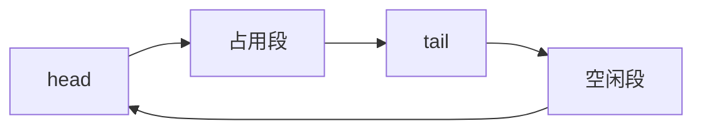

# 环形缓冲

头尾在定长数组上取模前进，物理上不必搬元素；满与空用计数或浪费一槽来区分。

<footer>—— 据 Knuth, The Art of Computer Programming 卷 1 整理</footer>

[上一课](/cs/deque)允许两端操作，并指出数组表示要用头尾下标绕回。[队列与缓冲](/cs/queue-buffer)已把环形当作实现细节提过。本课不重讲 FIFO 合同。缺口是把环写成一等表示：固定 `cap`、模算术、满空判别，以及为何它是生产者-消费者与 DMA 描述符环的默认布局。摊还扩容仍留给下一课。

## 问题

队列用动态数组在队头 `pop` 若每次把剩余元素左移，是 $\Theta(n)$。把头指针前移则留下空洞。缺口是**逻辑下标对 `cap` 取模**：物理槽循环使用，元素只在 enqueue/dequeue 时写一次。容量用尽不在本课倍增——有界缓冲把背压写成「满则失败或等待」。

`head==tail` 既像空又像满。必须另用 `count`，或规定「满时浪费一槽」使满为 `(tail+1)%cap==head`。

硬件环形缓冲与软件相同：指针前进、环绕。流水线寄存器链是深度固定、不能绕回的退化环。

## 方法

槽 `a[0..cap)`。入队写 `a[tail]`，`tail=(tail+1)%cap`。出队读 `a[head]`，`head=(head+1)%cap`。deque 的另一端对称。合法元素是从 `head` 走 `count` 步，不要扫整表。

无锁单生产单消费可以用独立的 head/tail 与内存序；本课只点名，不写 fence——那是体系结构栏的 TSO 课已经备过的对象，这里不把并发做成主干。

## 机制

顺序走环，空间局部性好，直到绕回边界：那一次访问从高地址跳到 `a[0]`，可能换页、换 cache 行集合。比链表仍稳。定容使实时系统最坏 $\Theta(1)$，没有动态数组那次线性复制。

与动态数组：环不改基址，已取出的指针若指向槽会在复用后别名——合同应禁止握着已出队槽。动态数组改基址，失效模式不同。

## 边界

本课不证明摊还，不把 `cap` 倍增写进环的热路径。需要无界增长时，下一课用表扩张分析，或用链表。也不把优先队列塞进环：那按键不按到达序。

后课默认：有界 FIFO/deque 的高性能表示是环形数组。偶发线性复制的平均代价，用摊还语言说。

## 小结

- 头尾取模，元素不搬；满空靠计数或浪费一槽。
- 定容最坏 $\Theta(1)$，绕回仍比链表连续。
- 倍增复制的平均账是下一课摊还。
- 出处：Knuth, *TAOCP* 卷 1 循环表与队列表示。
