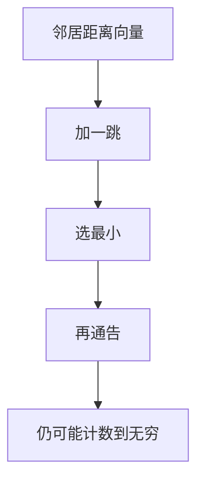

# RIP 对照

RIP 把到目的的距离收成跳数，定期推送整表；简单，但慢收敛、跳数上限 15，只适合对照，不适合当代骨干。

<footer>—— 据 RFC 2453 RIP Version 2；主干距离向量与计数到无穷课整理</footer>

主干[距离向量](/cs/distance-vector) 与[计数到无穷](/cs/count-to-infinity) 已讲 Bellman–Ford 病。[上一课](/cs/isis) 是链路状态骨干。缺口是**把 RIP 钉成对照物**：RIPv2 的跳数、水平分割、毒性逆转、组播 224.0.0.9。本课不把 BGP 决策阶梯写完。

## 问题

OSPF/IS-IS 用 LSDB 全局视图。RIP：邻居告诉我「我离某前缀 n 跳」，我加一。无穷=16，故直径不能大。定时器：更新、失效、垃圾回收，以十秒计，收敛远慢于 RSTP 握手，更慢于 IGP 的增量 SPF。认证可加，但不改算法。

不要把 RIP 的「跳」当成 OSPF 代价：一条 10G 与一条 64K 在 RIP 里可同为 1 跳。

RIPng 用于 IPv6，对象相同。本课不把 RIP 当推荐设计。教材保留它是为了理解 DV。

### 跳数不是带宽

16 为无穷，直径受限。水平分割缓解环，不消灭计数到无穷。当代骨干用链路状态；本课只对照向量病。

## 方法

对照三列：RIP / OSPF / IS-IS：信息、收敛、度量、范围。画：收表 → 加一 → 选最小 → 再通告。水平分割：不把从某口学来的路由原路送回，减轻环，不消灭计数到无穷。

方法止于选定对象与对照；机制才说它如何嵌入已有分层与主干课。

## 机制

为何主干还要这课：后课 BGP 也是向量（路径向量），但属性丰富、政策显式。RIP 是最简向量，用来记住：没有拓扑图时环与慢收敛是默认。LACP、巨帧与 RIP 无关。

与 MAC 学习对照：学习是过滤表，RIP 是路由表；两者都会因过时项转发错误，老化时间尺度不同。

## 边界

本课不引入 EIGRP 的 DUAL 全文。BGP 属性与决策是下一课。后课默认：域内当代用链路状态；RIP 仅对照。

小型实验室可用 RIP，互联网边界不行。

上一课留下的缺口在本课收口；「RIP 对照」进入后课词汇表后只引用。文献用来钉对象与边界，不把本课写成该主题的独立综述。下一课[BGP 属性与决策](/cs/bgp-attributes-decision)。

## 小结

- RIP：跳数 DV，16 为无穷，收敛慢。
- 水平分割是缓解不是定理。
- 用来对照 OSPF/IS-IS 与后课 BGP。
- 后课只引用本课钉死的对象，不从该领域总问题重开。
- 出处：RFC 2453；距离向量主干课。
