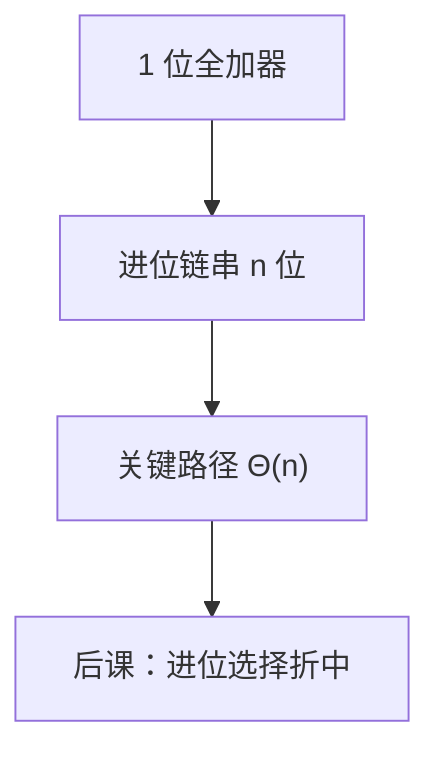

# 行波进位对照

超前进位把进位写成 $g,p$ 的与或；行波则老老实实让 $c_{i+1}$ 等 $c_i$，功能相同，关键路径差一个 $\Theta(n)$。

<footer>—— 据 Harris and Harris, Digital Design and Computer Architecture；Patterson and Hennessy, Computer Organization and Design (RISC-V) 整理</footer>

上一课[加法器与超前进位](/cs/adder-cla)已经给出全加器与 $g,p$。本课不重推 $c_{i+1}=g_i+p_i c_i$，也不从补码溢出再证。缺口是：CLA 为什么值得画，必须把**行波加法器**当作对照物钉死——面积小、接线短、延迟随位宽线性涨。

## 问题

$n$ 位 RCA：第 $i$ 位全加器的进位出接到第 $i+1$ 位进位入。关键路径穿过每一位的进位逻辑，[关键路径](/cs/critical-path)上 $t_{pd}\approx n\cdot t_{\mathrm{carry}}$。缺口不是新的加法语义，而是量这一条链：字长从 8 到 64，同一结构会从「可接受」变成单周期的瓶颈。

本课只钉 RCA 的结构与延迟阶。进位选择、乘法阵列是后课。

### 行波不是「算错了的 CLA」

每一位的和、进位布尔式与用 CLA 展开后的值相同。差别只在中间进位是否提前算完。把 RCA 当成过时算法、CLA 当成另一种算术，会把后课进位选择说成第三种加法定义。

Harris 先画 RCA 再引入 4 位 CLA 积木。Patterson/Hennessy 用加法器延迟说明为何 ALU 是关键路径候选。本课不把流水线拆加引进来。

## 方法

位片：$(s_i,c_{i+1})=\mathrm{FA}(a_i,b_i,c_i)$，$c_0$ 为加/减控制。画时序：最坏是 $c_0$ 传到 $c_n$ 再出 $s_{n-1}$。面积：$\Theta(n)$ 个全加器，无额外 $g,p$ 树。

## 机制

后课 ALU 可以先用 RCA 把功能跑通，再用 CLA 换延迟。教材单周期常在图上画一个 ALU 框，框内是哪一种加法器只改 $T$，不改控制表。减法仍是 $\bar B$ 加 $c_0=1$，与上一课相同，只是进位走链。

## 边界

本课不讲并行前缀加法器（Kogge–Stone 等）的布线拥塞。不把异步进位完成信号当默认同步设计。

后课默认：RCA 功能正确、延迟线性；CLA 用面积换深度。下一课在两者之间再放一种分块并行。

## 小结

- RCA：进位位片串联，关键路径随 $n$ 线性。
- 与 CLA 算术等价，只比延迟与面积。
- 加减接线不变，仍用 $c_0$。
- 出处：Harris and Harris；Patterson and Hennessy, COD (RISC-V)。
