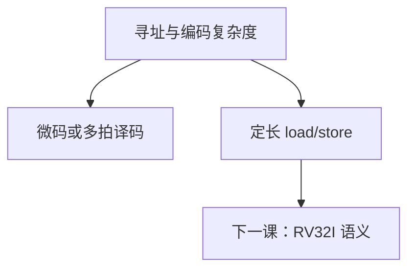

# RISC 与 CISC

把内存操作收成 load/store、指令定长、寻址很少，译码才能是组合；复杂指令把这些藏进微码，换的是编码密度与历史兼容。

<footer>—— 据 Patterson and Hennessy, Computer Organization and Design (RISC-V) 整理</footer>

上一课[寻址方式](/cs/addressing-modes)钉死了 RV32I 只有很少几种有效地址。本课不重列基址+偏移，也不从 1970 年代 ISA 战争写综述。缺口是把「为什么故意少」收成原则：**RISC** 让后课单周期/流水线可画；CISC 用微码或多拍吃掉复杂寻址。

## 问题

CISC：变长编码、一条指令里存储器到存储器、丰富寻址，硬件译码或微程序。[多周期与微程序](/cs/multicycle-microcode)已有直觉，本课提前用它当对照。RISC：定长、load/store、运算只在寄存器、简单寻址、可见寄存器多。缺口不是品牌点名，而是组成后果：RISC 的关键路径短、控制表小；CISC 的 CPI 与取指都更烦。

当代 x86 在内部译成 RISC 式微操作，程序员模型仍 CISC。本课承认这层，不把解码缓存写完。

### RISC 不是「指令条数少所以快」

指令条数可能更多（要把复杂操作拆开）。快来自容易流水、易编译、易满足时序。用「精简=更少 opcode」衡量，会把 RISC-V 的扩展误解成背叛。

Patterson/Hennessy 用 RISC-V 贯穿。本栏从此以 RV32I 为运行 ISA。CISC 只作对照，不把 x86 当主干指令表。

## 方法

对照表：编码长度、访存是否掺进运算、寻址种类、控制实现（组合 vs 微码）。RISC-V 再加：`opcode` 位置固定，便于[译码器](/cs/decoder-encoder)硬连。

## 机制

后课整数指令只给寄存器与简单访存的语义，硬件才能在单周期图上接线。伪指令、CSR 是汇编与特权的薄层，不把 ISA 变回 CISC。性能比较必须用同一基准上的 CPI×$T$×指令数，不能只比指令条数。

## 边界

本课不评哪家赢了市场，不把 VLIW、栈机展开。压缩 16 位 `C` 是密度扩展，语义仍 RISC，不在本课。

后课默认：主干 CPU 是 RISC、load/store、定长 32 位；下一课给出 RV32I 每条做什么。

## 小结

- RISC：定长、load/store、少寻址、组合译码。
- CISC：复杂编码与寻址，代价在微码/多拍。
- 「精简」指硬件规则，不是 opcode 最少。
- 出处：Patterson and Hennessy, COD (RISC-V)。
