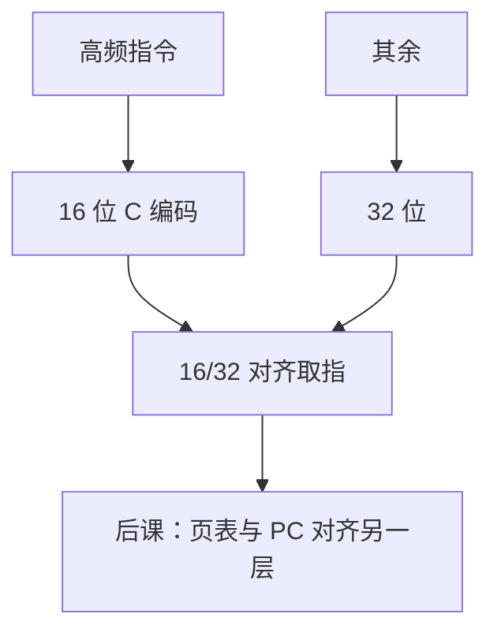

# RISC-V 压缩指令

  
`C` 扩展用 16 位编码最常见的操作：码密度靠近 CISC，译码仍只要区分 16/32，不必回到 x86 的前缀迷宫。

  <footer>—— 据 The RISC-V Instruction Set Manual, Volume I；Patterson and Hennessy, Computer Organization and Design (RISC-V) 整理</footer>

[上一课](/cs/rvv-vector)加宽了数据通路。取指带宽与 I-cache 仍吃**指令字节**。缺口是 **RVC**：常见 `addi`/`lw`/`jal` 的短编码，与 [ARM vs RISC-V](/cs/arm-vs-riscv) 里「A64 不定长、RV 可选混长」那一行兑现。

## 问题

纯 32 位对齐浪费 I-cache。RVC：最低两位不是 `11` 则为 16 位指令，映射到 32 位语义超集（不是新功能）。缺口不是向量 VL，而是**对齐**：16 位指令可落在半字，32 位指令仍须 16 位对齐但不能跨过非法边界——取指单元要能吞两种。

没有 RVC 的实现只跑 32 位，软件需统一 ABI（psABI 规定是否含 C）。与 x86 变长：长度种类少得多，没有 ModR/M 链。

### 压缩不是 Thumb-2 的全部历史

ARM Thumb 有自己的模式切换与编码表。RVC 与 32 位在同一用户模式混排，不靠 `j` 进「压缩模式」。把 RVC 当另一套特权，链接器会配错。

RISC-V ISA Manual 的 C 扩展章。Patterson/Hennessy 用压缩提高密度。本课不背 16 位 opcode 图。

## 方法

汇编器自动选 C 形式或 `.option rvc`。反汇编要按 16/32 扫描，类似简化版[长度解码](/cs/x86-64-encoding)。异常：`pc` 仍指向指令首字节，16 位指令的 `pc+2`。与 JAL 范围：压缩跳转位移更短，远目标用 32 位 `jal`。

静态密度增益典型两成量级（程序依赖），本课不编造百分比保证。

## 机制

下一课 Sv39 管虚拟地址，与指令长度正交，但取指跨页要两条翻译。位操作扩展也是 32 位编码为主。本课把「RISC 也能密度」钉住，完成与 x86 对照的密度轴。

## 边界

本课不讨论 Zc 进一步压缩子集的全部别名。不把压缩当加密。不保证所有扩展都有 C 别名。

后课默认：RVC 用 16 位别名常见指令；取指按 2 字节步进识别 16/32。

## 小结

- `C` 提高码密度，语义仍是 32 位指令的子集。
- 混长只有两种，不是 x86 前缀树。
- 与 A64 纯 32 位是明确差异。
- 出处：RISC-V ISA Manual, Vol. I；Patterson and Hennessy, COD (RISC-V)。
