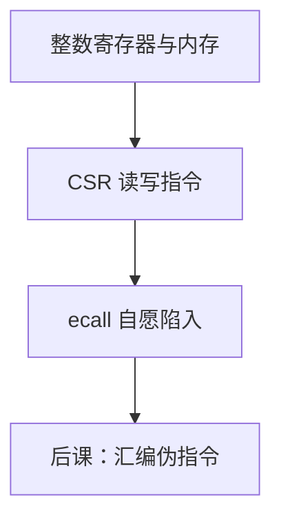

# RISC-V CSR 与 ecall

整数指令只改通用寄存器与内存；机器状态、陷阱入口、关中断放在 CSR 里，自愿进入更高特权用 `ecall`，不是再来一条 `add`。

<footer>—— 据 Patterson and Hennessy, Computer Organization and Design (RISC-V)；The RISC-V Instruction Set Manual, Volume II: Privileged Architecture 整理</footer>

上一课[RISC-V 整数指令](/cs/riscv-int-isa)钉死了 RV32I 对 `x` 寄存器与内存的变换，并把 CSR、系统调用后置。本课不重列 `addi` 语义，也不从 Linux syscall 号另起。缺口是：**控制与状态寄存器**以及自愿陷入，后课异常入口会用到这些名字。

## 问题

`csrrw`/`csrrs`/`csrrc`（及立即数变体）按 12 位地址读写 CSR，同时把旧值写进 `rd`。教学需要认识的名字：`mtvec`、`mepc`、`mcause`、`mstatus`（特权课再讲谁能写）。`ecall`：同步陷阱，不经 `jal`，硬件保存 PC、跳到入口。[异常入口](/cs/exception-interrupt-entry)展开路径；本课先把指令与 CSR 编号钉进 ISA。

`ebreak` 给调试器。用户态乱写 CSR 会非法——特权级后置，本课承认「不是谁都能写」。

### `ecall` 不是函数调用约定

没有编译器安排的 `ra` 与栈帧。返回用 `mret`/`sret` 从 CSR 取 PC。把 `ecall` 当成 `jal` 到操作系统，会把 ABI 与陷阱混层。

特权手册定义 CSR 地址与 `mcause` 编码。Patterson/Hennessy 用系统调用说明用户/内核边界，细节在后课。本课不把 SBI 功能表抄完。

## 方法

指令仍 32 位：`csr` 字段在高 12 位，`rs1`/`rd` 位置与 I 型一致。数据通路多一个 CSR 堆（小、偏时序）。`ecall` 不产生 ALU 结果，只触发控制路径。

## 机制

后课伪指令 `csrr`/`csrw` 是这些指令的简写。单周期要为 CSR 加端口与异常 MUX；没有本课，`lw` 故障无处可跳。中断使能位在 `mstatus`，采样在后课 PLIC 之前先有软件可写的开关。

## 边界

本课不讲分页相关 CSR、不把性能计数器当内容。浮点 `fcsr` 是同一机制的另一块地址空间。

后课默认：机器状态在 CSR；`ecall` 是陷入不是 `jal`。下一课伪指令把常用序列收成助记符。

## 小结

- CSR 用专用指令读写；入口相关寄存器在此命名。
- `ecall` 自愿陷阱，返回靠 `mret` 一类。
- 谁能写 CSR 由后课特权级挡住。
- 出处：Patterson and Hennessy, COD (RISC-V)；RISC-V Privileged Spec。
