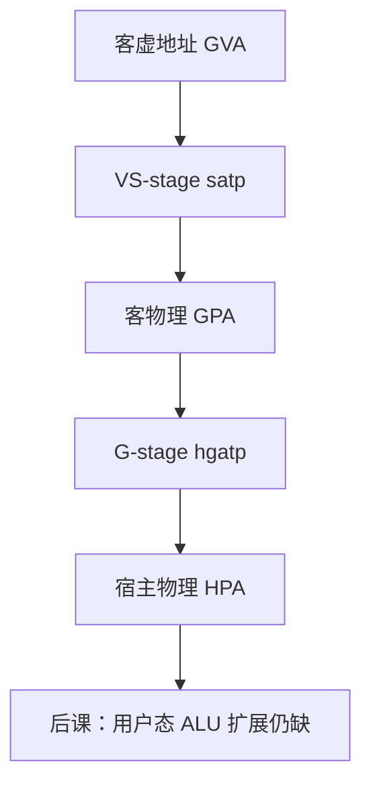

# RISC-V 虚拟化 H 扩展

  
H 扩展给 S 态加上 hypervisor：客机仍走自己的 Sv39，客物理地址再经 G-stage 译到宿主物理地址，影子页表不必跟每一次客内核填 PTE。

  <footer>—— 据 The RISC-V Instruction Set Manual, Volume II: Privileged Architecture；ARM ARM（EL2 / Stage-2）；Intel SDM（EPT）整理</footer>

[上一课](/cs/sv39-page-table)钉的是单层 `satp`。[EPT 与 NPT](/cs/ept-npt) 已在 x86 侧讲过两层翻译。[ARM 对 RISC-V](/cs/arm-vs-riscv) 把虚拟化对照留在 EL2。缺口是 **RISC-V H**：VS/VU 模式与 `hgatp`，而不是再画一遍三级 VPN。

## 问题

没有 H 时，VMM 只能用影子页表，或把客内核当用户进程跑。[Sv39](/cs/sv39-page-table) 的 `satp` 只有一套根。H 扩展引入：HS（hypervisor 扩展的 S）、VS（虚拟 S）、VU（虚拟 U）。客 OS 以为自己在写 `satp`，硬件实际用 VS-stage 把 GVA→GPA，再用 `hgatp` 的 G-stage 把 GPA→HPA。缺口不是再解释「什么是虚拟机」，而是**第二层页表挂在哪颗 CSR 上**。

两层都可以缺：VS 缺页交给客内核；G-stage 缺页（GPA 未映射）交给 hypervisor，对应 EPT violation。

### H 不是「再开一个 M 态」

M 态仍是最高。Hypervisor 跑在 HS，不靠把全部敏感指令降到机器态模拟。把 H 理解成第三份 RV32I，对照课会失去两阶段 MMU。也不把本课写成某开源 hypervisor 的启动日志。

RISC-V Privileged Spec 的 Hypervisor 章是权威。ARM Stage-2 与 Intel EPT 是对照，不在本课重写项格式。本课不背 `hstatus` 每一位。

## 方法

VMM 为每个客机配置 `hgatp`（G-stage 根，格式可与 Sv39 同类树）。客内核照常填自己的页表。取指与 load/store 经两层；TLB 缓存组合结果，`HFENCE.VVMA` / `HFENCE.GVMA` 分别冲客与 G-stage，对象不是 [内存 fence](/cs/fence-instructions)。

Hypervisor 需要读客虚拟地址：`HLV`/`HSV` 一类指令在 HS 按 VS 翻译访问客内存，避免自己切 `satp`。中断：注入与委托走 `hideleg`/`hvip`，对照 GIC 虚拟化，本课只点名。

嵌套虚拟化与 IOMMU 第二层不在本课展开；[DMA](/cs/dma-scatter-gather) 的设备地址仍要 IOMMU，不是 `hgatp` 自动覆盖。

## 机制

ISA 对照轴上，H 把 RISC-V 的特权故事补到与 EL2/VMX 可引用的位置：页表格式仍是 Sv39 一类树，只是串了两次。用户态整数、压缩、向量并不因 H 改变编码。下一课位操作扩展回到 ALU：地址生成与位域仍是编译器每天发射的缺口，与虚拟化正交。

## 边界

本课不保证某硅片已实现 H，不写 virtio 队列，不把侧信道写成利用步骤。不把 Type-1/Type-2 产品分类当 ISA 定义。

后课默认：H 扩展用 VS-stage + G-stage 两层翻译；`hgatp` 是宿主看客物理的根。下一课位操作。

## 小结

- VS 翻译客虚地址，G-stage 再译客物理。
- 对照 EPT / ARM Stage-2，CSR 与栅栏名不同。
- 不替代 M 态，也不改用户 ALU。
- 出处：RISC-V Privileged Spec（H）；ARM ARM；Intel SDM（EPT）。
