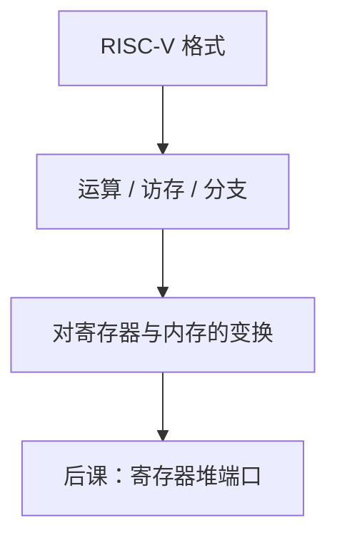

# RISC-V 整数指令

RV32I 用一套固定格式覆盖运算、访存、分支与跳转；每条指令的语义是对寄存器与内存的确定变换。

<footer>—— 据 Patterson and Hennessy, Computer Organization and Design (RISC-V)；The RISC-V Instruction Set Manual, Volume I 整理</footer>

上一课[RISC 与 CISC](/cs/risc-cisc)钉死了字段布局。本课不重拼立即数位，也不从「什么是 RISC」的历史综述另起。缺口是：字段还没有**语义**。数据通路要对着具体指令接线：哪些读寄存器、是否访存、PC 如何更新。

## 问题

格式课给出 R/I/S/B/U/J。缺口是 RV32I 核心操作：`add`/`sub`/`and`/`or`/`xor`/`sll`/`slt` 等 R 型；立即数版本 `addi`、`lw` 的地址 `rs1+imm`、`sw` 的 S 型；`beq`/`bne`/`blt`/`bltu` 相对 PC 的偏移；`jal`/`jalr` 写返回地址；`lui`/`auipc` 建宽常数。`x0` 硬接 0，写它丢弃。

本课只钉整数用户级子集。CSR、特权、浮点、`fence` 的完整内存模型后置。

### `addi` 不是「把立即数当无符号」

12 位立即数符号扩展再加，与[补码](/cs/twos-complement)一致。`sltiu` 把扩展后的值当无符号比。把所有 `*i` 当零扩展，负数立即数会错。移位量只取低 5 位（RV32）。

Patterson/Hennessy 第 2 章用 RV32I 当全书例子。官方手册是规范；本课按教材范围：够画单周期数据通路的那些指令。

## 方法

对每类指令列：用哪些寄存器口、ALU 作什么、是否读/写内存、下一 PC 是 +4 还是 PC+offset 或 jalr 目标。分支比较用[比较器](/cs/comparator-circuit)或 ALU 零/小于。加载宽度 `lw`/`lh`/`lb` 与符号扩展、零扩展要分开。

## 机制

有了语义，才能说「这条指令需要两个读口、一个写口、ALU、数据存储器」。没有的功能（整数除法在 M 扩展）本课不假装存在。伪指令 `li`、`mv` 是汇编器合成，硬件仍只看见真实编码。

对齐：`lw` 地址应 4 的倍数，否则异常——入口课再接。本课承认约束。

## 边界

本课不讲向量、不把 Linux syscall 编号当 ISA。RV64 只把寄存器与立即数加宽，本课以 32 位教学。压缩指令是同一语义的另一编码。

后课默认：谈到「一条整数指令」，语义在 RV32I 这张表上；硬件要提供 32×32 位寄存器与按语义接线的功能单元。

## 小结

- RV32I 给出运算、访存、分支、跳转的确定语义。
- `x0` 为 0；立即数多数符号扩展。
- 伪指令不是额外硬件。寄存器堆下一课实现。
- 出处：Patterson and Hennessy, COD (RISC-V)；RISC-V ISA Manual, Vol. I。
