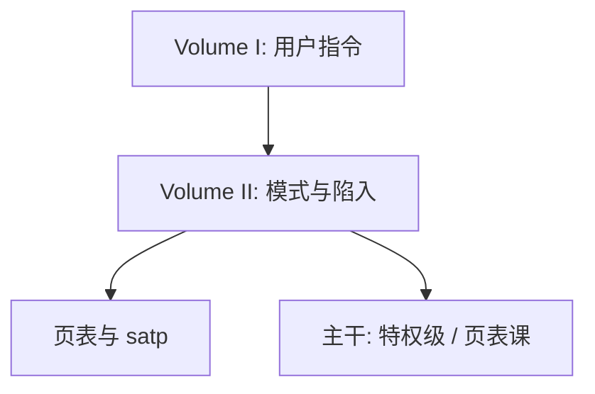

# RISC-V 特权手册对照

Volume II 把 M/S/U、CSR、陷入与虚存写成对 Volume I 用户 ISA 的补充契约；页表与中断入口是手册里的状态机，不是操作系统源码。

<footer>—— The RISC-V Instruction Set Manual, Volume II: Privileged Architecture</footer>

[上一课](/cs/tanenbaum-mos)附录对照了 MOS 教材地图。附录对照，不插入主干。主干已在[RISC-V 整数指令](/cs/riscv-int-isa)、[特权级](/cs/privilege-rings)、[异常与中断入口](/cs/exception-interrupt-entry)、[多级页表](/cs/multi-level-page-table)里按教学需要取用手册；这里对照 **特权手册的问题**：用户 ISA 不够运行内核时，硬件必须提供哪些额外状态与陷阱。不重画单周期数据通路，也不把本篇插回组成课中间。

## 问题

Volume I 给出 RV32I 对寄存器与内存的变换。特权手册的缺口是：模式、`mstatus`/`sstatus`、陷入向量、`satp` 与页表格式、内存保护。Tanenbaum 从 OS 讲资源；手册从硬件契约讲「内核凭什么比用户多几条指令」。主干组成课已经用这份契约接上中断与页表；附录对照原文结构，避免把 Linux 当 ISA。

手册有版本。主干取教学稳定的 M/S/U 与 Sv32/Sv39 直觉，不跟踪每年扩展字母汤。型号审计仍是附录级。

## 方法

对照章节：特权级与 CSR 列表、陷阱处理、物理内存保护、虚存。主干[内核与用户态](/cs/kernel-user) 把手册的模式收成 OS 边界；[系统调用路径](/cs/syscall-path) 对应 `ecall`。附录不把全部 CSR 地址背进课序。

## 机制

手册让「引用监视器」有硬件牙齿：用户写不了 `mtvec`。这与 Lampson 矩阵、THE 分层同方向、不同层。网络教材下一篇对照的是 Kurose/Ross，对象换成协议栈，不再加 CSR。

### 为何对照而不插入主干

主干必须在单周期与流水线课用一份具体 ISA 接线；把整本 Volume II 插在 MOS 之后当「下一课组成」，课序会倒流。本篇只对照手册作为组成/OS 边界的出处。文献序列在网络教材后再停。

## 边界

不要把 OpenSBI 或某块开发板设备树写进本附录当必读。也不要在此开虚拟化扩展的全部二阶段页表——主干 EPT 课已点到为止。下一篇对照 Kurose and Ross。

对照结束应回到主干[特权级](/cs/privilege-rings)与[按需调页](/cs/demand-paging)。手册不插入安全课之后当续篇组成。

## 小结

- 附录对照 RISC-V Volume II：模式、CSR、陷入、虚存契约。
- 主干组成与 OS 课已取用；本篇不插入流水线课中间。
- 出处：RISC-V Privileged Architecture 手册。
