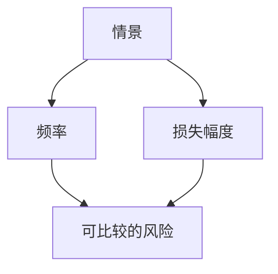

# 风险量化

风险是频率与损失的语言。FAIR 一类把情景写成可比较的分布，而不是红黄绿。数字差也会误导：没有暴露面与控制，CVSS 不能当唯一输入。

<footer>—— 据 Freund and Jones, *Measuring and Managing Information Risk*（FAIR）；对照 NIST CSF；[CVE 与 CVSS](/cs/cve-cvss)</footer>

## 定位

上一课[可用安全](/cs/usable-security)说明人会绕过。缺口是**决策语言**：把情景量化以便排优先级。本课 FAIR 直觉，不假装精算完成。

后课默认已经读完本课钉下的合同，只补差，不从该领域第一性原理重开。

## 问题

颜色标签不可加。缺口：情景、威胁共同体、抵抗强度、损失幅度。数据稀疏则给区间。

### 不是金融定价

不把期权或 LOB 搬进本课。

FAIR。零信任下一课是架构响应之一。

## 方法

写一条情景到损失。对照 CVSS 只是技术严重度。下一课零信任架构。

图中节点是本课的机制骨架；课程不把图展开成可运行的攻击步骤。

## 机制

给钱与工程一个接口。零信任是减少情景发生条件的架构。

前提写进合同之后，游戏外的误用只当失败模式点名，不在本课写成操作程序。

## 边界

不编造精确损失表。零信任架构下一课。

## 小结

- 可用安全之后，管理层要用可比较的风险。
- 情景、频率、幅度；CVSS 只是输入之一。
- 稀疏数据用区间，不用假精确。
- 下一课零信任架构。
- 出处：Freund and Jones, FAIR；NIST CSF；[cve-cvss](/cs/cve-cvss)。
