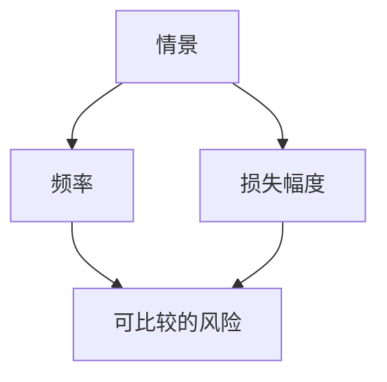

# 风险量化

风险是频率与损失的语言。FAIR 一类把情景写成可比较的分布，而不是红黄绿。数字差也会误导：没有暴露面与控制，CVSS 不能当唯一输入。

<footer>—— 据 Freund and Jones, *Measuring and Managing Information Risk*（FAIR）；对照 NIST CSF；[CVE 与 CVSS](/cs/cve-cvss)</footer>

上一课[可用安全](/cs/usable-security)说明人会绕过难用的控制；缺口是**决策语言**——把安全情景量化，管理层才能排优先级。本课 FAIR 直觉，不假装精算完成。

后课默认已经读完本课钉下的合同，只补差，不从该领域第一性原理重开。

## 问题

红黄绿的毛病是颜色不可加也不可比：两个黄加起来是什么？FAIR 一类的回答是把每个情景拆成频率与损失幅度两个分布——频率由威胁事件量与抵抗强度（控制多硬）决定，幅度由资产与后果决定，随机模拟卷出年化损失的分布。数据稀疏时不编点估计，给区间。

### 不是金融定价

本课不是金融定价：不把期权公式或限价簿搬进来——安全事件没有可连续对冲的市场，这里只借概率语言。

FAIR。零信任下一课是架构响应之一。

## 方法

方法是把一条情景从起因写到钱：「勒索软件经 VPN 凭据进入」拆成发生频率分布与单次损失分布（赎金、停机、恢复、合规），合成年化损失分布，再按中位数与尾部排控制优先级。对照 CVSS：它只是技术严重度，没有暴露面与资产价值，不能单独当风险。下一课零信任架构。

```mermaid
flowchart TD
  SCEN["情景"] --> FREQ["频率"]
  SCEN --> MAG["损失幅度"]
  FREQ --> RISK["可比较的风险"]
  MAG --> RISK
```

## 机制

机制是给钱与工程之间一个接口：工程师报「控制把情景频率压到多少」，管理层问「这笔钱买回多少期望损失下降」，两边在损失分布上对齐量纲。误差要说实话：频率估计常有数量级的不确定度，量化的价值在可比较与可复核，不在数字精确。零信任是减少情景发生条件的架构。

## 边界

不编造精确损失表；边界要点名：尾部大额损失恰是数据最稀的地方，报告要带置信区间，不能只给期望值。零信任架构下一课。

## 小结

- 可用安全之后，管理层要用可比较的风险。
- 情景、频率、幅度；CVSS 只是输入之一。
- 稀疏数据用区间，不用假精确。
- 下一课零信任架构。
- 出处：Freund and Jones, FAIR；NIST CSF；[cve-cvss](/cs/cve-cvss)。
