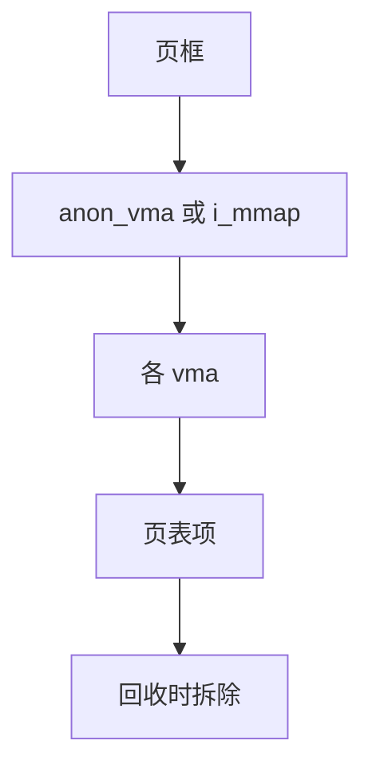

# 反向映射 rmap

正向页表从虚址找到页框；反向映射从页框找到所有 pte，回收、迁移、unmap 才知道该拆哪几条翻译。

<footer>—— 据 Gorman, <em>Understanding the Linux Virtual Memory Manager</em>；Bovet and Cesati 对对象反查的整理</footer>

[上一课](/cs/socket-options)收口网络。虚存主干已有 [分页](/cs/demand-paging) 与 [TLB](/cs/tlb-shootdown)。缺口是 **rmap**：物理页上的「谁映射了我」，否则 shrinker 无法对匿名页与文件页做 try_to_unmap。

## 问题

一页可被父进程、子进程、[KSM](/cs/ksm) 合并者、多个 vma 同时映射。回收要：清 pte、打 TLB、必要时换出。没有反查只能扫所有进程页表——不可行。缺口：匿名页用 `anon_vma` 树串 vma；文件页用 `address_space` 的 i_mmap 树。本课不把锁的全部层级写成死锁论文。

fork 后 COW 页仍共享页框，rmap 条目变多。unmap 文件时走 i_mmap。对象是「页框 → pte 集合」。

## 方法

缺页安装 pte 时：把 vma 挂到 anon_vma 或 interval tree。回收：`try_to_unmap` 遍历 rmap，把 pte 改成 swap/file 项，`tlb_flush`。[页缓存](/cs/page-cache) 的文件页同样经 i_mmap 找到 mmap 了该文件的进程。对照 [sk_buff](/cs/skbuff) 的引用计数：一个是包，一个是页框映射。

## 机制

rmap 让「物理内存是共享资源」可执行：回收不必知道进程号先验。它是后课迁移、THP 拆页、mlock 会计的底座。不要写成数据库二级索引课，虽然结构都是反查。与 [RDMA](/cs/rdma-os) 钉页：钉住的页 rmap 仍在，但不能换出。

fork 复杂度与 rmap 锁是可伸缩痛点，实现用锁分段。

实现上：anon_vma 锁是回收路径的热点，锁分段与批量 unmap 都为这个。KSM 合并后 rmap 更长，try_to_unmap 更贵。文件截断走 i_mmap，要和页锁交织。 读法上只引用[上一课](/cs/socket-options)的结论，不把对象换成训练推理或限价簿。

本课在操作系统进阶的「内存进阶 / 回收、迁移与加固」课序里，对象是 **反向映射 rmap**。

- 先修只引用，不重导：上一课的结论当公理，本课只补差。
- 五栏不吞并：不把本课写成大模型训练/推理，也不写成限价簿或权重量化。
- 文献用 OSTEP、McKusick、内核文档与具名会议论文；不发明 arXiv 编号。

## 边界

本课不引入 device-exclusive 等特殊 rmap。不保证 32 位高内存的每条路径。下一课利用 rmap 把页搬走：迁移与 compaction。

版本字段会变，课序钉的是机制对象「反向映射 rmap」，不是某一主线内核的结构体名。
后课默认：页框能反查到所有 pte。为了凑大页或离线内存而搬家，下一课。

## 小结

- rmap 从页框走到 pte；回收依赖它。
- 匿名走 anon_vma，文件走 i_mmap。
- 页迁移与 compaction 是下一课。
- 出处：Gorman *ULVMM*；Bovet *ULK*；Linux mm。
