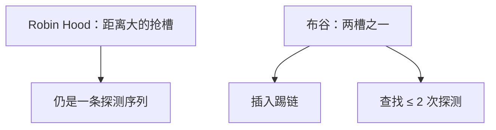

# Robin Hood 与布谷

线性探测会聚集；Robin Hood 让探测距离更齐，布谷用两个表把插入变成踢人，最坏查找可以钉成常数次探测。

<footer>—— 据 Celis, Larson and Munro, Robin Hood Hashing, FOCS 1985；Pagh and Rodler, Cuckoo Hashing, ESA 2001 / J. Algorithms 2004 整理</footer>

[上一课](/cs/chaining-open-address)钉了链与开放寻址，点名线性探测聚集，并声明不引入 Cuckoo。本课不重讲 $\alpha$ 与墓碑。缺口是两种把开放寻址的探测长度压住的策略：Robin Hood 按「已走距离」抢槽；布谷散列每个键两个候选位置，插入时踢走占用者。跳表与布隆在后课，本课仍是字典的放置策略。

## 问题

线性探测成功查找的期望随 $\alpha/(1-\alpha)$ 涨，聚集让方差很大：个别键探测很长。缺口不是换 $h(k)$——上一课函数已经均匀——而是**插入时重排已有键的位置**。Robin Hood：比较当前键的探测距离与槽内键的距离，远者抢槽，被抢的继续探测。查找仍沿探测序列，但最长探测距离更短、更齐。

布谷：两个散列 $h_1,h_2$，键只住两处之一。查找最多两次。插入把占用者踢到它的另一处，可能连环；过长则再散列。

布谷的「两个巢」来自布谷鸟占巢的比喻。负载通常要留空（$\alpha$ 明显小于 1），否则踢链失败频繁。

## 方法

Robin Hood：开放寻址 + 每槽记录或可重算的探测距离；插入时若 `dist(新) > dist(住户)` 则交换。删除仍要墓碑或反向回填，回填比普通线性探测更要小心距离。

布谷：查 $h_1(k)$ 与 $h_2(k)$。插：若有空则放入；否则踢出其中一个，令其去另一表对应槽，循环直到空槽或踢次数上限。

## 机制

两者都改善尾部延迟，服务最坏探测比 plain 线性探测稳。Robin Hood 对 cache 仍友好（顺序探测）。布谷查找探测次数有硬上限，适合要最坏界限的硬件转发表；插入可能失败需重建，合同是「期望插入成功，失败则再散列」。

与链地址：$\alpha\gt 1$ 仍只有链轻松支持。这两种都要求表内有空槽。

## 边界

本课不引入 Hopscotch、不把密码学哈希当必须。布隆过滤器下一课：**不是字典**，不存键本身，允许假阳性。并发 cuckoo 的位移序列是附录。

后课默认：开放寻址可用 Robin Hood 或布谷压探测尾部。只需「可能在/一定不在」且省空间，用布隆。

## 小结

- Robin Hood 均衡探测距离；布谷把查找钉在两个位置。
- 插入可能重排或再散列；$\alpha$ 不能顶满。
- 布隆过滤器是下一课的近似集，不是精确字典。
- 出处：Celis et al., *FOCS*, 1985；Pagh and Rodler, *J. Algorithms*, 2004；对照 CLRS 开放寻址。
