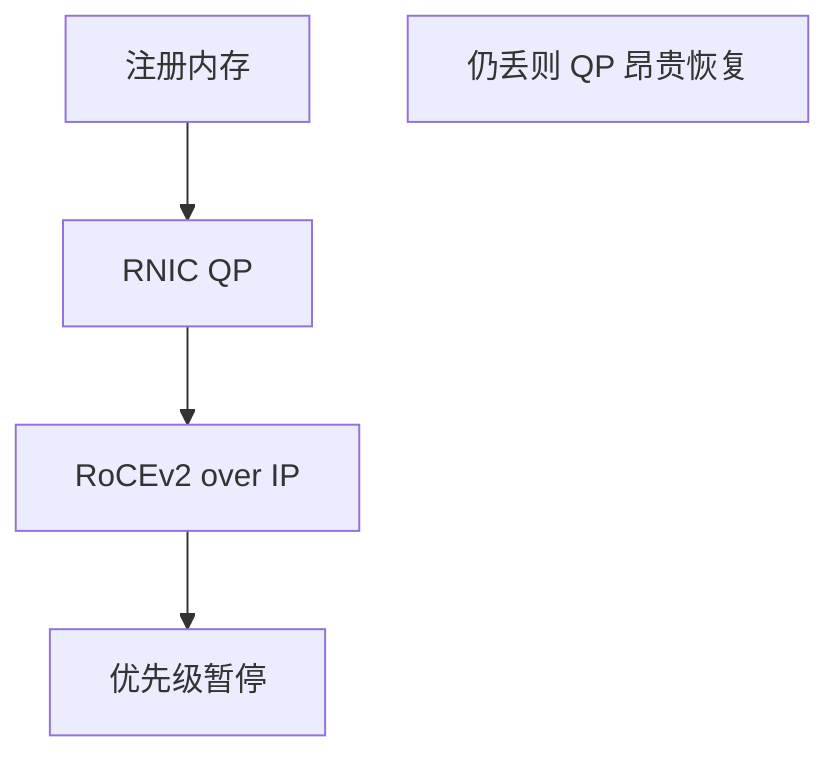

# RoCE 与无损网络

RDMA 把远程内存操作放到网卡，绕过内核；RoCEv2 用 UDP/IP 承载，依赖 PFC 等把以太网做成「不丢」的假象。

<footer>—— 据 InfiniBand 架构对照；RoCEv2 规范；IEEE 802.1Qbb 实践整理</footer>

[PFC](/cs/pause-pfc) 与 [DCTCP](/cs/dctcp) 已给反压与浅队列。[上一课](/cs/dctcp) 仍是 TCP。缺口是 **RoCE**：网卡 QP、无损以太网、与 TCP 栈对照。本课结束转发面课序。

## 问题

存储与 GPU 集合通信要微秒级、低 CPU。[套接字](/cs/socket-api) 系统调用与拷贝太重。RDMA：RNIC 直接读写对端内存。InfiniBand 原生有基于信用的链路；RoCEv2 把 IB 运输装进 UDP，走 IP Clos——但 UDP 不重传，丢包让 QP 停顿昂贵，于是要 PFC 无损 + 可选 DCQCN。这是把端到端可靠性下放到链路与网卡，Saltzer 警告的那种优化：一旦无损失败，没有 TCP 兜底。

不要把 RoCE 写成「更快的 TCP」：语义是 RDMA，不是字节流。

RoCEv2 目的端口 4791。PFC 死锁与暂停风暴是已知运营风险。本课不写 verbs API 全集。

### RDMA 怕丢

RoCEv2 走 UDP/IP，靠 PFC/DCQCN 维持无损假象。失败恢复昂贵。语义不是字节流。留在数据中心。

## 方法

对照：TCP 拷贝 vs RNIC 零拷贝。画：应用注册内存 → QP → RoCEv2 包 → PFC 队列。VXLAN 上跑 RoCE 要内层无损与外层 DSCP 映射，困难。

方法止于选定对象与对照；机制才说它如何嵌入已有分层与主干课。

## 机制

incast 对 RoCE 更致命，故 PFC+ECN。HOL：PFC 整类暂停会冻无关 QP。ECMP 乱序对 RDMA 不友好，常要保序或网卡重排。MTU 用巨帧摊头。与 5G URLLC 对照：都是用资源换尾延迟，一层在机房以太网，一层在空口。

## 边界

本课不引入 iWARP 的全部。AIMD 与 Chiu–Jain 是下一单元第一课。后课默认：RoCE 依赖无损与网卡卸载；失败模式与 TCP 不同。

互联网广域不假设 PFC，RoCE 留在数据中心。

上一课留下的缺口在本课收口；「RoCE 与无损网络」进入后课词汇表后只引用。文献用来钉对象与边界，不把本课写成该主题的独立综述。下一课[AIMD 与 Chiu–Jain](/cs/aimd-dynamics)。

## 小结

- RoCEv2：RDMA over UDP/IP，怕丢。
- PFC/DCQCN 维持无损假象，有暂停风险。
- 不替代公网 TCP。
- 后课只引用本课钉死的对象，不从该领域总问题重开。
- 出处：RoCEv2；802.1Qbb；InfiniBand 对照。
