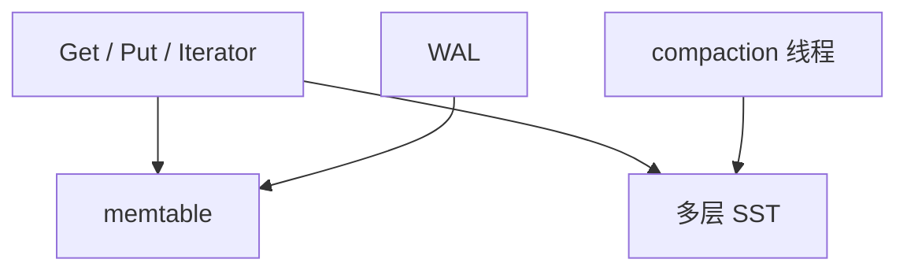

# RocksDB

嵌入式 LSM：memtable、SST、compaction、WAL、列族。数据库用它当本地引擎，SQL 与分布式协议在它之上。

<footer>—— 据 Facebook RocksDB；LevelDB；O'Neil LSM 课的产品落地</footer>

NewSQL 在[上一课](/cs/newsql)收口。本课打开数据模型族：许多系统把节点内存储交给 RocksDB（或同类）。缺口不是再推导 leveled，而是**嵌入式合同**：无 SQL、无网络、调用者负责事务边界与线程。列族、事务、备份 API 如何接到前面的 WAL/MVCC。

## 问题

RocksDB 提供 KV、可选事务（悲观锁或乐观）、快照、检查点、SST 摄入。缺口是调用者：MyRocks、TiKV、各种 NewSQL 本地。配置：compaction 风格、块缓存、写停顿——LSM 课的运维在此变成选项名。SQL 优化器看不见 SST，只看见「一次 Get/Iterator」的代价，校准要按 LSM 读放大。

列族：多套 LSM 共享 WAL，类似多表空间。与宽列不同，仍是 KV。

RocksDB 源自 LevelDB 加强。本课机制与嵌入边界。不把调参手册抄满。

## 方法

写：Put 进 memtable+WAL。读：Get 走布隆+各层。扫描：Iterator 多路归并。事务：WriteBatch 或 TransactionDB。检查点：硬链 SST 给备份。与 CDC：WAL 可被上层抽，或上层另写。

线程：compaction 后台池与用户线程争 CPU/I/O，要限额，否则 OLTP 尾延迟。

## 机制

与缓冲池：块缓存代替页池，替换策略仍抗扫描。pin 变成 iterator 钉块。无 B+ latch crabbing，有文件引用计数。TDE 可在文件层。

版本：快照序列号，GC 与 compaction 水位——MVCC GC 课的 LSM 实例。

## 边界

本课不讲文档模型。也不把 RocksDB 当事务管理器的全部（分布式仍在上层）。图/时序常在上面再编码。

后课默认：见到「用 RocksDB」就用 LSM 放大与写停顿读它。文档数据库：嵌套文档与二级索引，常仍 LSM 底下。

嵌入式引擎把 SQL 优化器的「表」变成 KV 的编码约定。

## 小结

- RocksDB 是嵌入式 LSM：WAL、SST、列族、本地事务。
- 上层负责 SQL 与分片；调参即 LSM 合同。
- 文档数据库下一课。
- 出处：RocksDB/LevelDB；O'Neil LSM。
