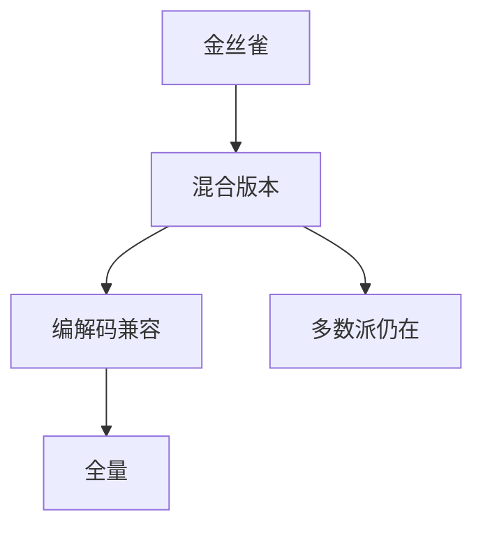

# 滚动升级

一次换一副本，集群保持法定人数。窗口里新旧二进制共存，协议必须向前或向后兼容，否则升级本身就是分区。

<footer>—— 据 Google SRE 实践；Raft/Paxos 成员与版本混合；Kubernetes 滚动更新整理</footer>

上一课[地理复制](/cs/geo-replication)让多版本更常见。缺口是**变更怎么上线**：停机切全部违反可用性；滚动切要求混合版本正确。本课钉兼容与法定人数，不重写 k8s 控制器。分布式系统课序下一课用 TLA+ 给协议收口。

## 问题

滚动：每次下 $k$ 个实例，等健康再继续。对 Raft：活着的旧+新必须仍能凑多数派，且日志格式能互读。对 API：生产者新字段，消费者旧代码忽略（前向）；旧生产者缺字段，新代码有默认（后向）。双向窗口要先扩消费者再扩生产者，或反过来按依赖——顺序是规格。

缺口：把滚动当「没有故障」。滚动是可控的漏发与崩溃停实验，检测器会抖，对冲会打到旧实例。

SRE 书强调金丝雀与错误预算。协议课强调混合版本的状态机 $\delta$ 必须对旧条目仍确定。

## 方法

两阶段升级：先发只读懂新旧的代码，再发只写新的代码。Feature flag 把行为与二进制解开。etcd/k8s：先升数据面再升控制面或按文档顺序，避免 API 服务器比 kubelet 更新时的未知字段。

不要在滚动中途改多数派定义（成员变更课）除非协议允许嵌套。

## 机制

脑裂：新旧若用不同选举超时默认值，可能一边更易当选。配置默认值也是协议。Schema：protobuf 字段号稳定性比 JSON 随意增删更可滚动。

本课不写蓝绿与金丝雀的产品对照全书。也不写应用迁移 SQL 的全部坑，只点名：存储 schema 滚动与二进制滚动要同一纪律。

失败回滚：必须能反向兼容，否则只能前进。这是单向飞行——要在设计里避免。

## 边界

本课不把每次发布当混沌实验替代。后课默认：协议变更走两阶段兼容；滚动窗口里 SLO 用尾延迟盯着。TLA+ 下一课可把「新旧消息交错」写成状态，比在生产第一次遇见便宜。

混合版本是一等故障模式。不写进规格的字段，滚动时会出现。

## 小结

- 滚动保持法定人数，制造长期混合版本。
- 编解码与 $\delta$ 要双向兼容或两阶段。
- 默认超时与 schema 都是协议；回滚要预先能反向。
- 出处：SRE 发布实践；Raft 成员；k8s 滚动更新。
