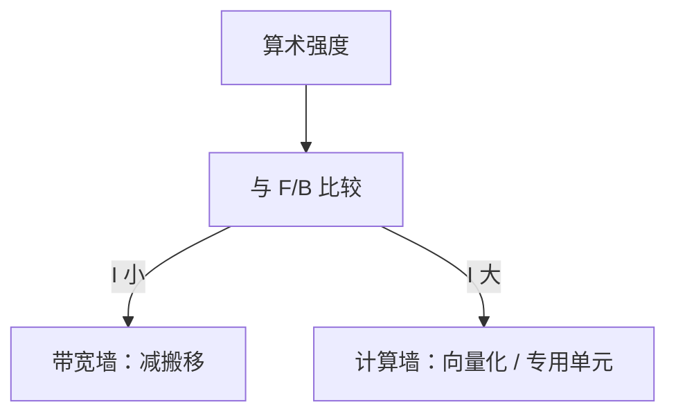

# Roofline 模型

把核的峰值算力和内存带宽画成屋顶：内核的算术强度落在哪一侧，就决定你该减访存还是加 FLOP 实现，而不是盲目加核。

<footer>—— 据 Williams, Waterman, and Patterson, Roofline: An Insightful Visual Performance Model, CACM 2009 整理</footer>

[上一课](/cs/pmu-counters) 能读带宽与运算事件。[Gustafson](/cs/gustafson-law) 不告诉你被哪堵墙挡住。本课不重讲采样。缺口是 **Roofline：算术强度 $I = W/Q$（运算/字节）对照机器屋顶。**

## 问题

代码慢，有人加线程，有人展开循环。[MLP](/cs/mlp-memory-parallelism) 提高的是延迟隐藏，屋顶仍可能是 DRAM 字节/秒。缺口不是再加一个 PMU 事件名，而是**一张图：横轴强度，纵轴性能，斜线是带宽×强度，横线是峰值算力。**

Williams–Waterman–Patterson：屋顶随层次变（L1/L2/DRAM 多条斜线）。落在斜线上是带宽受限；横线上是计算受限。

## 方法

测或查：$B$ 为有效带宽（注意 [NUMA](/cs/multi-socket-interconnect) 与 [合并](/cs/memory-coalescing)），$F$ 为峰值 FLOP/s（注意向量宽度与频率墙）。画 $P\le \min(F, B\cdot I)$。把内核画成点；优化：提高 $I$（复用、blocking、[脉动](/cs/systolic-array)）或提高有效 $B$（预取、合并、放对层次）。

## 机制

与 Amdahl 正交：Amdahl 是串行比，Roofline 是已并行内核的强度。DSA 与 GPU 各有自己的屋顶。不要在这里画大模型训练的集群 Roofline 当本课主体。gem5 下一课可以输出用于画屋顶的计数，但模拟带宽要校准。

点落在屋顶之下：还有对齐、bank 冲突、[发散](/cs/warp-divergence)、指令混合不是峰值 FMA。屋顶是上界，不是自动达到的工作点。先垂直爬到屋顶（微结构/向量化），再沿强度轴右移（算法 blocking）。

## 边界

本课不把缓存带宽的每一条斜线标定到某 SKU。MTTF 与可靠性下一单元末才出现；Roofline 不管错误。模拟器用来解释「为何点落在屋顶下」（端口、对齐）。

后课默认：先判断墙，再改算法或微结构参数。gem5 给出可控的结构旋钮与统计。

## 小结

- Roofline 用强度区分带宽墙与计算墙。
- 层次不同屋顶不同；NUMA 降低有效 $B$。
- gem5 用模拟把结构旋钮变成可重复实验，下一课。
- 出处：Williams, Waterman, Patterson, *CACM*, 2009。
