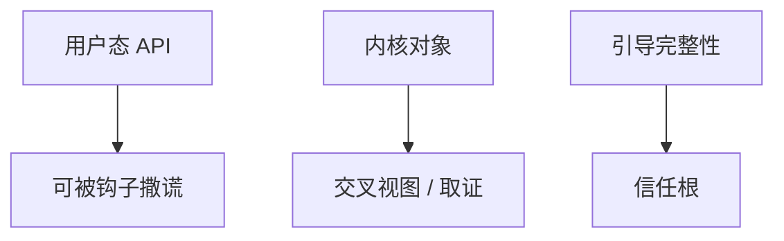

# rootkit

rootkit 要的是隐瞒：改内核对象、拦截列举、住进引导。检测若只问用户态 API，看见的是它安排的剧场。信任应下沉到度量启动与带外取证。

<footer>—— 据 Hoglund and Butler, *Rootkits*；对照 NIST SP 800-155 对 BIOS 完整性的讨论；seL4 对最小 TCB</footer>

## 定位

上一课[恶意软件](/cs/malware-analysis)常仍在用户态。缺口是**隐蔽与持久在更高特权**。本课讲为何 API 不可信、检测要下沉，不给编写 rootkit 的步骤。

后课默认已经读完本课钉下的合同，只补差，不从该领域第一性原理重开。

## 问题

用户态列举进程可被钩子过滤。内核或虚拟化 rootkit 改的是观察者本身。缺口是：完整性要从不可被目标改写的根度量（后课安全启动）。

### 课程禁止实现

不教挂钩、不教隐藏模块。只讲防御观察点。

Hoglund and Butler 是历史技术书；本课当威胁模型引用。检测：交叉视图、内存取证、TPM 度量。

## 方法

对照用户态 / 内核 / 引导。防御：安全启动链、内核模块签名、远程证明后课。下一课加固与混淆：防御方与恶意方都会用混淆，目标相反。

图中节点是本课的机制骨架；课程不把图展开成可运行的攻击步骤。

## 机制

特权一旦丢，同机自检变弱。下一课二进制加固与混淆：合法软件防篡改 vs 恶意软件抗分析——本课只站在防御与审计。

前提写进合同之后，游戏外的误用只当失败模式点名，不在本课写成操作程序。

## 边界

本课无 rootkit 源码。二进制加固与混淆下一课。

## 小结

- 恶意软件分析在用户态会碰到撒谎的 API。
- rootkit 把观察者变成目标。
- 检测下沉到度量启动与带外。
- 下一课加固与混淆。
- 出处：Hoglund and Butler；NIST SP 800-155；对照 Klein et al. seL4。
