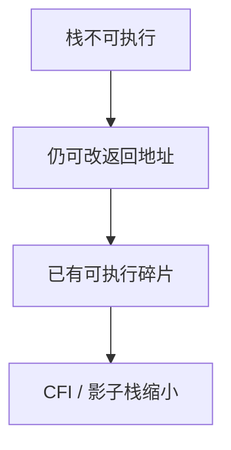

# ROP

栈不可执行之后，控制流仍可被改成「已有代码的短片段」再串起来。返回导向等于把程序里的 ret 当成指令集。防御是控制流完整性与减少可用碎片，不是再加长 canary。

<footer>—— Shacham, The Geometry of Innocent Flesh on the Bone, CCS 2007；对照 Abadi 等 CFI</footer>

## 定位

上一课[canary](/cs/stack-canary)挡连续踏帧。缺口是**返回地址仍可被改向已映射可执行页**。ROP 是这种能力的名字。本课说明为何 NX 不够，以及 ASLR/CFI/影子栈要对付什么——不提供 gadget 收集或利用链。

后课默认已经读完本课钉下的合同，只补差，不从该领域第一性原理重开。

## 问题

NX 禁止数据上取指。若攻击者能写返回地址（或等价控制数据），可跳到已有指令序列的末尾 `ret`，再弹下一个。缺口是：可执行镜像成了指令仓库。课程只承认这一事实。

### 禁止利用链

不列出 gadget、不写链、不给工具命令。工程课要的是：开 CFI、影子栈、减少 RWX、及时打补丁。

Shacham 2007。ASLR 提高定位代价，不是证明。本课与[侧信道](/cs/side-channel)的信息泄漏正交：泄漏会削弱 ASLR。

## 方法

用「控制数据 → 已有代码」一句话收机制。列出缓解：ASLR、CFI、影子栈（后课）、指针认证（再后）。强调内存安全语言从根上缩小该类。

图中节点是本课的机制骨架；课程不把图展开成可运行的攻击步骤。

## 机制

完整性要从「页不可执行」升级到「跳转目标合法」。下一课 JOP/COP：不以 `ret` 为唯一缝合，同一防御族。

前提写进合同之后，游戏外的误用只当失败模式点名，不在本课写成操作程序。

## 边界

本课无 PoC。JOP/COP 下一课只对照缝合原语。

## 小结

- canary/NX 不够：返回地址仍能指向已有代码。
- ROP 是控制流劫持的一种缝合方式。
- CFI、ASLR、影子栈是防御方向。
- 下一课 JOP/COP。
- 出处：Shacham, CCS 2007；Abadi et al., CFI。
