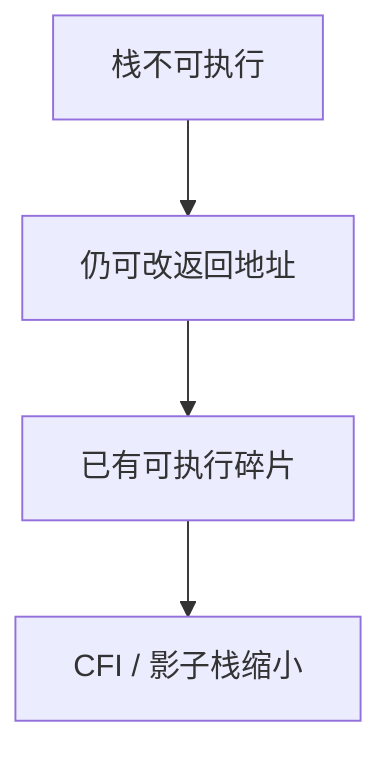
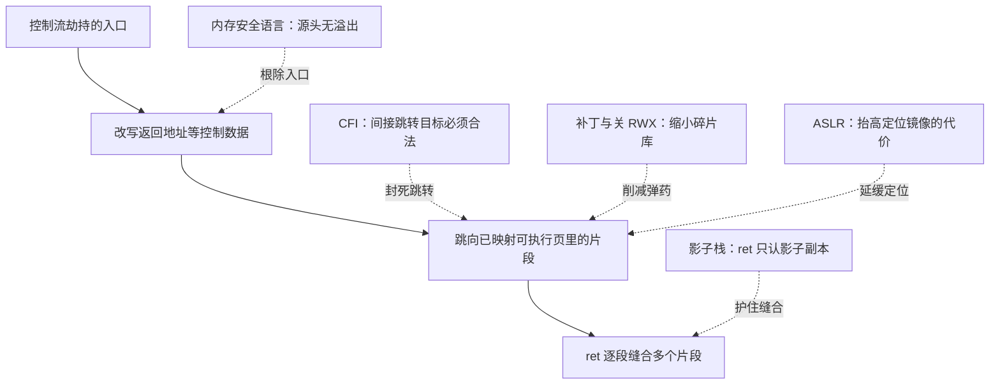

# ROP

栈不可执行之后，控制流仍可被改成「已有代码的短片段」再串起来。返回导向等于把程序里的 ret 当成指令集。防御是控制流完整性与减少可用碎片，不是再加长 canary。

<footer>—— Shacham, The Geometry of Innocent Flesh on the Bone, CCS 2007；对照 Abadi 等 CFI</footer>

上一课[canary](/cs/stack-canary)挡连续踏帧。缺口是**返回地址仍可被改向已映射可执行页**。ROP 是这种能力的名字。本课说明为何 NX 不够，以及 ASLR/CFI/影子栈要对付什么——不提供 gadget 收集或利用链。

后课默认已经读完本课钉下的合同，只补差，不从该领域第一性原理重开。

## 问题

NX 禁止数据上取指。若攻击者能写返回地址（或等价控制数据），可跳到已有指令序列的末尾 `ret`，再弹下一个。缺口是：可执行镜像成了指令仓库。课程只承认这一事实。

术语翻译：gadget 就是「程序镜像里现成的几条指令、结尾恰好带一个 ret」的小碎片——攻击者的「指令集」不是自己带进来的，而是从你的可执行文件里捡出来拼的。所以镜像越大、库越多，可拼的碎片库越大。

### 禁止利用链

不列出 gadget、不写链、不给工具命令。工程课要的是：开 CFI、影子栈、减少 RWX、及时打补丁。

Shacham 2007。ASLR 提高定位代价，不是证明。本课与[侧信道](/cs/side-channel)的信息泄漏正交：泄漏会削弱 ASLR。

## 方法

用「控制数据 → 已有代码」一句话收机制。列出缓解：ASLR、CFI、影子栈（后课）、指针认证（再后）。强调内存安全语言从根上缩小该类。

直觉类比：这种攻击像小偷不带任何工具，进屋后全用地主家现成的锤子和螺丝刀干活——翻他口袋查不出凶器，该管的是门锁：每次「用工具」都要先证明他有资格拿。

```mermaid
flowchart TD
  NX["栈不可执行"] --> STILL["仍可改返回地址"]
  STILL --> FRAG["已有可执行碎片"]
  FRAG --> CFI["CFI / 影子栈缩小"]
```

## 机制

完整性要从「页不可执行」升级到「跳转目标合法」。下一课 JOP/COP：不以 `ret` 为唯一缝合，同一防御族。

站在防御视角，各缓解措施分别切断劫持链条的哪一环：

```mermaid
flowchart TD
  V["控制流劫持的入口"] --> W["改写返回地址等控制数据"]
  W --> X["跳向已映射可执行页里的片段"]
  X --> Y["ret 逐段缝合多个片段"]
  M["内存安全语言：源头无溢出"] -.->|根除入口| W
  S["影子栈：ret 只认影子副本"] -.->|护住缝合| Y
  C["CFI：间接跳转目标必须合法"] -.->|封死跳转| X
  P["补丁与关 RWX：缩小碎片库"] -.->|削减弹药| X
  A["ASLR：抬高定位镜像的代价"] -.->|延缓定位| X
```

常见误区：初学者容易以为 canary 已经挡住了所有栈攻击。实际上 canary 只在函数返回前核对哨兵值；若控制数据是通过别的漏洞（如任意写）直接改的，哨兵根本没被踩到——这正是还需要影子栈与 CFI 的原因。

## 边界

本课无 PoC。JOP/COP 下一课只对照缝合原语。

## 小结

- canary/NX 不够：返回地址仍能指向已有代码。
- ROP 是控制流劫持的一种缝合方式。
- CFI、ASLR、影子栈是防御方向。
- 下一课 JOP/COP。
- 出处：Shacham, CCS 2007；Abadi et al., CFI。
