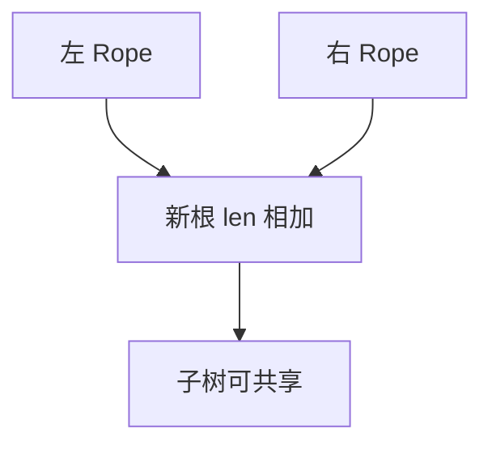

# Rope

大串拆成叶上的短块，内部节点只记长度；拼接与分裂走平衡树，不必整缓冲 memcpy。

<footer>—— 据 Boehm, Atkinson and Plass, Ropes: An Alternative to Strings, Software: Practice and Experience, 1995；Okasaki, Purely Functional Data Structures 整理</footer>

[上一课](/cs/string-hashing) 的前缀表在插入中间字符时整表作废。[数组](/cs/array-random-access) 中间插入 $\Theta(n)$。[可持久化线段树](/cs/persistent-segment-tree) 已演示路径复制。本课不滚动窗口。缺口是 Rope：把字符串当可并序列树（常平衡 BST / treap），叶存片段。

## 问题

编辑器、版本化文档：拼接、切区间、插删中间。连续 `char[]` 每次搬移。Rope：二叉树，节点 `len` = 子树字符数，叶是不可变小串。`concat` 建新根（可共享子树）；`split` 按 rank 切开，同[顺序统计](/cs/order-statistic-tree) 与隐式 treap。缺口是**把下标当键的可持久序列**，字符比较按叶扫描或再挂哈希。

Boehm et al., *SPE*, 1995（Cedar / SGI 实践）。函数式语言里同构于树状序列。Okasaki 给持久拼接的摊还图像。

## 方法

索引 $i$：用 `len` 向左或向右减。平衡：Treap 优先级或 AVL 高度，避免退化成链。扁平化：过小叶合并，过大叶再切，控制常数。可持久：concat/split 不写旧节点。

与 HAMT：Rope 按位置；下一课 HAMT 按哈希路径存映射。与后缀数组：Rope 动态，SA 静态。

## 机制

单次索引 $O(\log n)$ 节点再加叶内偏移。遍历全串 $\Theta(n)$ 但 cache 不如一块缓冲。哈希可挂在节点上做 $O(\log n)$ 取子串哈希，接上一课。不要用 Rope 当小串默认类型——阈值以下仍数组。

## 边界

本课不把 gap buffer、piece table 写完，只点名同问题的其他表示。并发编辑 OT/CRDT 不是 Rope 合同。哈希数组映射树下一课换「键→值」持久字典。

后课默认：大串编辑用 Rope/piece table。持久哈希映射用 HAMT。

## 小结

- Rope：树状串，concat/split 对数，可共享。
- 叶为短块；小串仍用数组。
- 下一课 HAMT 是持久字典，不是串。
- 出处：Boehm, Atkinson and Plass, *SPE*, 1995；Okasaki。
