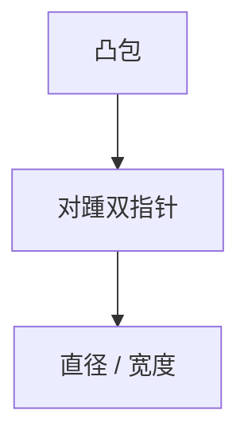

# 旋转卡壳

凸包上一对对踵点随边旋转；直径、最小宽度、凸多边形距离在 $O(n)$ 内扫完。

<footer>—— 据 Toussaint, Solving Geometric Problems with the Rotating Calipers, 1983；CLRS 第 33 章整理</footer>

上一课[凸包](/cs/convex-hull)给出凸多边形。直径：最远点对应在凸包上，且常是对踵。缺口是旋转卡壳：卡尺贴一条边，对侧点单调移动。不重写 Graham。后课扫描线。

## 问题

朴素 $O(h^2)$ 对包上点。卡壳：边 $e$ 的对踵（离直线最远点）随 $e$ 沿边界单调。直径 = 对踵距离最大值。最小面积外接矩形同技巧。两凸包最近/最远点对也可卡。

缺口是单调对踵，不是旋转几何公式课。

### 先凸包

非凸点集必须先凸包。卡壳假定凸。不要在凹多边形上直接转。

Toussaint 1983 综述卡壳。直径也见 Shamos。后课最近点对是分治，对象全体点不是直径。

## 方法

凸包逆时针。双指针 $i,j$。边 $(i,i+1)$ 时推进 $j$ 直到面积/叉积不再增。记录答案。转一圈 $O(h)$。

共线边要对齐策略。

## 机制

凸使对踵单调，不会来回。与卡尺物理图像一致。与旋转卡壳求矩形：角度在边上变化。与 SMAWK 无关。

## 边界

本课不写三维直径。带权卡壳不写。后课默认：凸多边形直径 $O(n)$ 卡壳。下一课扫描线。

## 小结

- 对踵随边单调；直径 $O(h)$。
- 先凸包 $O(n\log n)$。
- 只对凸多边形。
- 出处：Toussaint, 1983。
