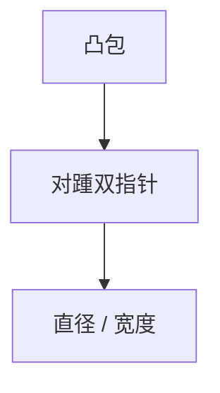

# 旋转卡壳

凸包上一对对踵点随边旋转；直径、最小宽度、凸多边形距离在 $O(n)$ 内扫完。

<footer>—— 据 Toussaint, Solving Geometric Problems with the Rotating Calipers, 1983；CLRS 第 33 章整理</footer>

上一课[凸包](/cs/convex-hull)把平面点集收成逆时针排好的凸多边形，本课直接在包上转。点集直径只落在包上，最远点对常是对踵的一对。缺口是把「两两配对」换成「卡尺贴边、对侧点单调移动」的一次环扫。不重写 Graham；后课扫描线沿用这一直觉。

## 问题

包上 $h$ 个点朴素两两配对量距离，$O(h^2)$；即使先凸包，$h$ 仍可到 $n$ 量级。卡壳的观察是：固定边 $e$，对侧离 $e$ 所在直线最远的点叫对踵点；当 $e$ 换到下一条边时，对踵点只会继续向前挪，不会后退。于是直径就是各边对踵距离的最大值。同一套扫法换判据：把「离直线最远」换成三点有向面积，得最小面积外接矩形；两凸包的最近、最远点对同样能双指针卡出来。

缺口是单调对踵，不是旋转几何公式课。

### 先凸包

输入若只是一团散点，必须先跑上一课的凸包，再在包上扫描，总复杂度由排序的 $O(n\log n)$ 主导。卡壳的单调性依赖凸性；在凹多边形上直接转，对踵会来回摆动，答案漏取甚至死循环。

Toussaint 1983 综述卡壳。直径也见 Shamos。后课最近点对是分治，对象全体点不是直径。

## 方法

先把顶点按逆时针排成数组，维护两个下标 $i,j$。固定边 $(i,i+1)$ 时，用叉积比较：只要 $j+1$ 比 $j$ 离这条直线更远就把 $j$ 加一，直到不再增；用这对 $(i,j)$ 的距离更新答案，再换下一条边。$j$ 一圈最多走 $2h$ 步，均摊后是 $O(h)$。

```mermaid
flowchart TD
  H["凸包"] --> CAL["对踵双指针"]
  CAL --> D["直径 / 宽度"]
```

共线边处可能给出两个等距候选，要固定对齐策略（取更远者或都试），否则直径在平手处漏掉。

## 机制

凸性把对踵变成单调函数：对边 $e$ 而言，对侧顶点到 $e$ 所在直线的距离沿边界先增后减，所以指针不必回头，总步数均摊成 $O(h)$。它与二重循环的本质差别是证明了其余点对不必看：一端钉在边 $i$ 上，另一端就由单调性钉死为这一个对踵点。物理图像就是卡尺：一脚贴边滑动，另一脚卡住对侧顶点。外接矩形版本里倾角只在换边处变化，$O(h)$ 个候选角里取最小面积。与 SMAWK 无关。

## 边界

本课不写三维直径——单峰论证在球面上失效，要换旋转球面的技术；带权卡壳与动态凸包也不写。后课默认：平面凸多边形的直径、宽度、外接矩形都能 $O(n)$ 卡出来。下一课扫描线。

## 小结

- 对踵随边单调；直径 $O(h)$。
- 先凸包 $O(n\log n)$。
- 只对凸多边形。
- 出处：Toussaint, 1983。
