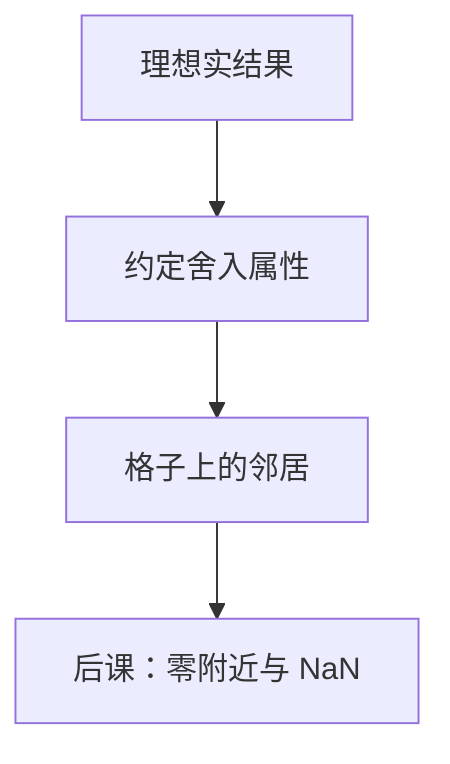

# 舍入模式

精确结果常常不在格子上；往哪一个可表示的邻居靠，必须先约定，否则同一算法换一台机器会换一批比特。

<footer>—— 据 IEEE Std 754-2008；Knuth, The Art of Computer Programming, Vol. 2；Goldberg, 1991 整理</footer>

上一课[IEEE 754](/cs/ieee-754)钉死了 `binary32`/`binary64` 的位型，并点名默认 round-to-nearest-even。本课不重列偏置与隐藏位，也不从「实数逼近论」另起。缺口是：有限尾数上，加减乘除的**精确数学结果**往往落在两个可表示数之间。默认模式被点了名，还没有说清还有哪些模式、平局怎么破、有向舍入给谁用。

## 问题

754 的格子不是 $\mathbb{R}$。运算先产生理想结果，再映射回格子。缺口因此不是再切指数宽度，而是钉一套**舍入属性**：最近偶数、朝零、朝正无穷、朝负无穷，以及 2008 年写清的 ties-to-away。同一表达式、同一操作数，模式不同则结果比特可以不同；数值库与区间算术依赖「朝哪边」可重复。

本课只钉二进制格式上这几条。非规格化与 NaN 在精确结果落到零附近或无效时才成为主角，那是[下一课](/cs/denormal-nan)。

### 最近偶数不是「四舍五入」

十进制四舍五入在 `.5` 处总是远离零，会引入单向偏差。754 的默认是：距离相等时选最低有效位为 $0$ 的那个（偶数）。把学校里的四舍五入直接当成默认，统计上的均值会偏，也与硬件默认不符。

IEEE 754-2008 §4 把舍入属性写成独立于格式的条款。Knuth Vol. 2 §4.2 强调浮点算术是有限集上的运算，舍入是定义的一部分，不是事后修饰。Goldberg 用例子说明同一表达式换模式后差在哪一位。

## 方法

记理想结果为 $x$，可表示集为 $F$。最近：选 $F$ 中距 $x$ 最小者；平局时默认选偶数尾数（`roundTiesToEven`），或选幅值更大者（`roundTiesToAway`）。有向：`roundTowardZero` 取不比 $x$ 更远离零的那个；`roundTowardPositive` / `roundTowardNegative` 分别不小于 / 不大于 $x$。不精确时置 inexact 旗标——旗标如何进陷阱，本课不接。

默认模式对大多数科学计算够用。区间算术需要有向舍入夹住真值；本课只承认这件事，不构造区间库。

## 机制

FMA 把乘加熔成一次舍入，与「先乘后加」两次舍入可以不同——上一课已承认。本课补的是：即便单次运算，模式也是 ABI 与控制寄存器的一部分。RISC-V 的 `frm` 选择模式；语言默认通常绑最近偶数。比较与哈希仍先问比的是比特还是数值：舍入改变的是产生哪些比特。

## 边界

本课不把十进制 754 的舍入另开一张表，不讨论随机舍入（stochastic rounding）作为训练技巧——那不是 754-2008 的强制属性。也不把误差界写成定理：Goldberg 的 ulp 讨论到能用为止，完整舍入误差分析不进主干。

后课默认：未声明时，二进制浮点舍入是 round-to-nearest-even；改变模式会改变结果比特。

## 小结

- 舍入把理想结果映回 754 格子；模式必须先约定。
- 默认最近偶数，平局选偶数尾数，不是十进制四舍五入。
- 有向舍入服务区间与定向误差；零附近的特殊值下一课再钉。
- 出处：IEEE 754-2008；Knuth, TAOCP Vol. 2；Goldberg, 1991。
